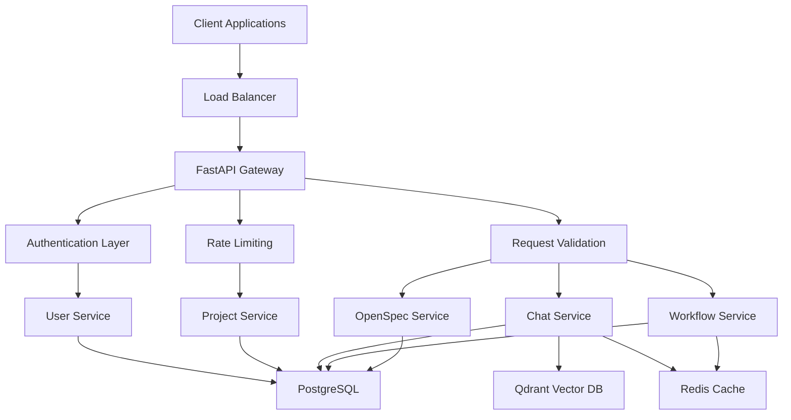

# Ardha API Documentation

## Overview

Welcome to the Ardha API documentation. Ardha is the world's first truly unified AI-native project management and development platform that eliminates the artificial boundary between planning and execution. This comprehensive API provides endpoints for authentication, project management, AI-powered workflows, chat systems, and specification management.

## Base URL

```
https://api.ardha.com/api/v1
```

**Development Environment:**
```
http://localhost:8000/api/v1
```

## API Architecture

The Ardha API follows RESTful principles with a modern, scalable architecture:



## Core Features

### 🤖 AI-Powered Workflows
- **Multi-Mode AI**: Research, Architect, Implement, Debug, Chat modes
- **LangGraph Integration**: Complex workflow orchestration
- **Cost Management**: Budget tracking and model routing
- **Memory System**: Context-aware AI responses

### 📋 Project Management
- **Project Workspaces**: Organized project containers
- **Task Management**: Comprehensive task tracking with dependencies
- **Milestone Tracking**: Timeline and goal management
- **Team Collaboration**: Role-based permissions and member management

### 💬 Intelligent Chat
- **Multi-Mode Conversations**: Specialized AI chat modes
- **Real-time Streaming**: WebSocket support for live interactions
- **Project Integration**: Context-aware project discussions
- **Cost Tracking**: Token and cost monitoring

### 📝 OpenSpec Integration
- **Specification Management**: Living documentation system
- **Proposal Workflow**: Review and approval processes
- **Task Generation**: Automated task creation from specs
- **Version Control**: Git-integrated specification management

### 🔐 Security & Authentication
- **JWT Authentication**: Secure token-based auth
- **OAuth Integration**: GitHub and Google login support
- **Role-Based Access Control**: Granular permissions
- **Rate Limiting**: Protection against abuse

## API Endpoints Summary

### Authentication API
**Base Path**: `/auth`

| Method | Endpoint | Description |
|--------|----------|-------------|
| POST | `/register` | Create new user account |
| POST | `/login` | Authenticate and get tokens |
| POST | `/refresh` | Refresh access token |
| POST | `/logout` | Logout current user |
| GET | `/me` | Get current user profile |
| PATCH | `/me` | Update user profile |

**Documentation**: [Authentication API](auth-api.md)

---

### Project API
**Base Path**: `/projects`

| Method | Endpoint | Description |
|--------|----------|-------------|
| POST | `/` | Create new project |
| GET | `/` | List user projects |
| GET | `/{id}` | Get project details |
| PATCH | `/{id}` | Update project |
| POST | `/{id}/archive` | Archive project |
| DELETE | `/{id}` | Delete project |
| GET | `/{id}/members` | List project members |
| POST | `/{id}/members` | Add project member |
| DELETE | `/{id}/members/{user_id}` | Remove member |

**Documentation**: [Project API](project-api.md)

---

### Task API
**Base Path**: `/tasks`

| Method | Endpoint | Description |
|--------|----------|-------------|
| POST | `/` | Create new task |
| GET | `/` | List tasks (with filters) |
| GET | `/{id}` | Get task details |
| PATCH | `/{id}` | Update task |
| DELETE | `/{id}` | Delete task |
| POST | `/{id}/assign` | Assign task to user |
| POST | `/{id}/dependencies` | Add task dependency |
| GET | `/{id}/activities` | Get task activities |

**Documentation**: [Task API](task-api.md)

---

### Milestone API
**Base Path**: `/milestones`

| Method | Endpoint | Description |
|--------|----------|-------------|
| POST | `/` | Create new milestone |
| GET | `/` | List milestones |
| GET | `/{id}` | Get milestone details |
| PATCH | `/{id}` | Update milestone |
| DELETE | `/{id}` | Delete milestone |
| GET | `/{id}/tasks` | Get milestone tasks |

**Documentation**: [Milestone API](milestone-api.md)

---

### Chat API
**Base Path**: `/chats`

| Method | Endpoint | Description |
|--------|----------|-------------|
| POST | `/` | Create new chat |
| POST | `/{id}/messages` | Send message (streaming) |
| GET | `/{id}/history` | Get chat history |
| GET | `/` | List user chats |
| GET | `/{id}` | Get chat summary |
| POST | `/{id}/archive` | Archive chat |
| DELETE | `/{id}` | Delete chat |

**WebSocket**: `/chats/{id}/ws` (Real-time streaming)

**Documentation**: [Chat API](chat-api.md)

---

### Workflow API
**Base Path**: `/workflows`

| Method | Endpoint | Description |
|--------|----------|-------------|
| POST | `/` | Create new workflow |
| GET | `/` | List workflows |
| GET | `/{id}` | Get workflow details |
| POST | `/{id}/execute` | Execute workflow |
| GET | `/{id}/status` | Get execution status |
| POST | `/{id}/pause` | Pause workflow |
| POST | `/{id}/resume` | Resume workflow |
| DELETE | `/{id}` | Delete workflow |

**Documentation**: [Workflow API](workflow-api.md)

---

### OpenSpec API
**Base Path**: `/openspec`

| Method | Endpoint | Description |
|--------|----------|-------------|
| POST | `/proposals` | Create proposal |
| GET | `/proposals` | List proposals |
| GET | `/proposals/{id}` | Get proposal details |
| PATCH | `/proposals/{id}` | Update proposal |
| POST | `/proposals/{id}/approve` | Approve proposal |
| POST | `/proposals/{id}/reject` | Reject proposal |
| POST | `/proposals/{id}/sync-tasks` | Sync tasks to database |
| POST | `/proposals/{id}/archive` | Archive proposal |

**Documentation**: [OpenSpec API](openspec-api.md)

## Quick Start Guide

### 1. Authentication

First, register a new account or login with existing credentials:

```python
import requests

# Register new user
response = requests.post("https://api.ardha.com/api/v1/auth/register", json={
    "email": "developer@example.com",
    "username": "dev_user",
    "full_name": "Developer User",
    "password": "SecurePass123"
})

# Login
response = requests.post("https://api.ardha.com/api/v1/auth/login", data={
    "username": "developer@example.com",
    "password": "SecurePass123"
})

tokens = response.json()
access_token = tokens["access_token"]
headers = {"Authorization": f"Bearer {access_token}"}
```

### 2. Create a Project

```python
# Create your first project
response = requests.post(
    "https://api.ardha.com/api/v1/projects",
    json={
        "name": "AI Project Management Platform",
        "description": "A comprehensive platform for managing AI-powered development projects",
        "visibility": "private",
        "tech_stack": ["Python", "FastAPI", "React", "PostgreSQL"]
    },
    headers=headers
)

project = response.json()
project_id = project["id"]
```

### 3. Start a Chat

```python
# Create a research chat
response = requests.post(
    "https://api.ardha.com/api/v1/chats",
    json={
        "mode": "research",
        "project_id": project_id
    },
    headers=headers
)

chat = response.json()
chat_id = chat["id"]

# Send a message (streaming response)
response = requests.post(
    f"https://api.ardha.com/api/v1/chats/{chat_id}/messages",
    json={
        "content": "Analyze the competitive landscape for AI project management tools",
        "model": "anthropic/claude-sonnet-4.5"
    },
    headers=headers,
    stream=True
)

# Process streaming response
for line in response.iter_lines():
    if line:
        data = json.loads(line.decode('utf-8'))
        if data.get('type') == 'chunk':
            print(data['content'], end='', flush=True)
```

### 4. Create Tasks

```python
# Create tasks for your project
response = requests.post(
    "https://api.ardha.com/api/v1/tasks",
    json={
        "title": "Implement user authentication",
        "description": "Add JWT-based authentication with OAuth support",
        "project_id": project_id,
        "priority": "high",
        "status": "todo"
    },
    headers=headers
)

task = response.json()
```

## Authentication

All API endpoints (except registration and login) require authentication via JWT token:

```http
Authorization: Bearer <your-jwt-token>
```

### Token Types

- **Access Token**: 15-minute lifetime for API requests
- **Refresh Token**: 7-day lifetime for obtaining new access tokens

### OAuth Support

The API supports OAuth authentication with:
- **GitHub**: `user:email` scope
- **Google**: `email profile` scope

## Rate Limiting

API requests are rate-limited to ensure fair usage:

| Endpoint Type | Limit | Duration |
|---------------|-------|----------|
| Authentication | 5 requests | 1 minute |
| Chat Messages | 10 requests | 1 minute |
| General API | 100 requests | 1 minute |
| File Uploads | 10 requests | 1 minute |

Rate limit headers are included in responses:
```http
X-RateLimit-Limit: 100
X-RateLimit-Remaining: 95
X-RateLimit-Reset: 1638360000
```

## Error Handling

The API uses standard HTTP status codes and provides detailed error messages:

### Standard Error Response

```json
{
  "detail": "Error description",
  "error_code": "SPECIFIC_ERROR_CODE",
  "timestamp": "2025-11-15T10:00:00Z"
}
```

### Common Status Codes

- `200`: Success
- `201`: Created
- `400`: Bad Request (validation error)
- `401`: Unauthorized (authentication required)
- `403`: Forbidden (insufficient permissions)
- `404`: Not Found
- `409`: Conflict (resource already exists)
- `422`: Unprocessable Entity (validation error)
- `429`: Too Many Requests (rate limited)
- `500`: Internal Server Error

## Data Models

### User Model

```json
{
  "id": "uuid",
  "email": "user@example.com",
  "username": "username",
  "full_name": "Full Name",
  "is_active": true,
  "avatar_url": "https://example.com/avatar.jpg",
  "created_at": "2025-11-15T10:00:00Z",
  "last_login_at": "2025-11-15T14:30:00Z"
}
```

### Project Model

```json
{
  "id": "uuid",
  "name": "Project Name",
  "description": "Project description",
  "slug": "project-name-123",
  "visibility": "private",
  "tech_stack": ["Python", "FastAPI"],
  "is_archived": false,
  "created_at": "2025-11-15T10:00:00Z",
  "updated_at": "2025-11-15T10:00:00Z",
  "member_count": 5
}
```

### Task Model

```json
{
  "id": "uuid",
  "title": "Task Title",
  "description": "Task description",
  "project_id": "uuid",
  "status": "todo",
  "priority": "high",
  "assignee_id": "uuid",
  "created_by_id": "uuid",
  "created_at": "2025-11-15T10:00:00Z",
  "updated_at": "2025-11-15T10:00:00Z"
}
```

## WebSocket Integration

### Real-time Chat Streaming

Connect to chat WebSocket for real-time messaging:

```javascript
const ws = new WebSocket(
    `wss://api.ardha.com/api/v1/chats/${chatId}/ws?token=${accessToken}`
);

ws.onmessage = (event) => {
    const data = JSON.parse(event.data);
    if (data.type === 'chunk') {
        console.log(data.content);
    }
};
```

### Workflow Updates

Receive real-time workflow execution updates:

```javascript
const ws = new WebSocket(
    `wss://api.ardha.com/api/v1/workflows/${workflowId}/ws?token=${accessToken}`
);
```

## SDK and Libraries

### Official SDKs

- **Python**: `pip install ardha-sdk`
- **JavaScript/TypeScript**: `npm install ardha-js`
- **React**: `npm install ardha-react`

### Community Libraries

- **Go**: Available on GitHub
- **Ruby**: Available as gem
- **PHP**: Available via Composer

## API Versioning

The API uses URL versioning: `/api/v1/`

### Version Support

- **v1**: Current stable version
- **v0**: Deprecated (migrate to v1)

### Backward Compatibility

- Breaking changes require new version
- Minor updates within version
- Deprecation notices for removed features

## Testing

### Sandbox Environment

For testing, use the sandbox environment:
```
https://sandbox-api.ardha.com/api/v1
```

### Test Data

The sandbox provides pre-populated test data:
- Test users and projects
- Sample workflows and chats
- Mock AI responses

## Monitoring and Analytics

### API Health

Check API status and health:
```http
GET /health
```

### Usage Analytics

Track your API usage:
```http
GET /api/v1/usage
Authorization: Bearer <token>
```

## Support

### Documentation

- **API Reference**: Detailed endpoint documentation
- **Guides**: Step-by-step tutorials
- **Examples**: Code samples and integration guides
- **FAQ**: Common questions and answers

### Community

- **GitHub Discussions**: Community forum
- **Discord**: Real-time chat support
- **Stack Overflow**: Tag questions with `ardha-api`

### Contact Support

- **Email**: api-support@ardha.com
- **Issues**: GitHub Issues for bug reports
- **Feature Requests**: GitHub Discussions

## Changelog

### v1.0.0 (2025-11-15)
- Initial stable API release
- Complete authentication system
- Project and task management
- AI-powered chat and workflows
- OpenSpec integration

### v1.1.0 (Planned)
- Enhanced workflow capabilities
- Advanced analytics endpoints
- Improved error handling
- Performance optimizations

## License

The Ardha API is licensed under the MIT License. See [LICENSE](https://github.com/ardhaecosystem/Ardha/blob/main/LICENSE) for details.

## Contributing

We welcome contributions to the API documentation and SDK development. See our [Contributing Guide](https://github.com/ardhaecosystem/Ardha/blob/main/CONTRIBUTING.md) for details.

---

**Next Steps**:
1. Read the specific API documentation you need
2. Check out the Quick Start Guide above
3. Explore the examples and integration guides
4. Join our community for support and discussions

**Happy coding with Ardha! 🚀**
