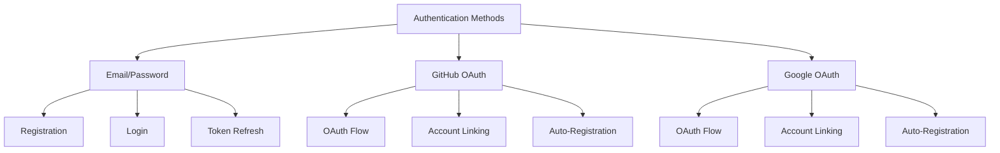
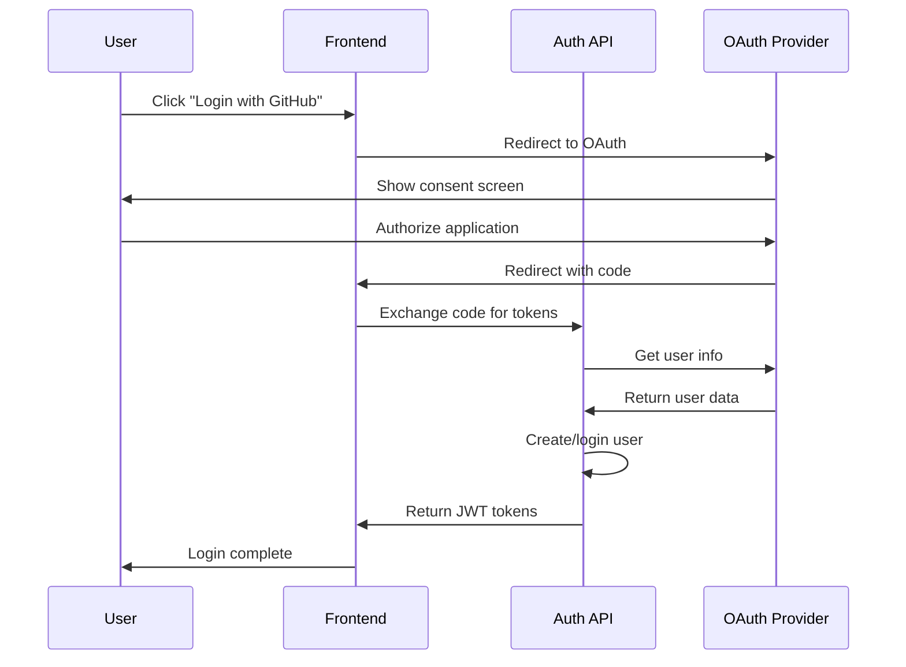

# Authentication API Documentation

## Overview

The Authentication API provides comprehensive user authentication and account management capabilities, including traditional email/password authentication, OAuth integration (GitHub, Google), JWT token management, and user profile operations. The API uses bcrypt for secure password hashing and implements industry-standard security practices.

## Base URL

```
/api/v1/auth
```

## Core Concepts

### Authentication Methods

The API supports multiple authentication methods:



### JWT Token System

**Access Tokens:**
- **Lifetime**: 15 minutes
- **Purpose**: API authentication
- **Format**: JWT with user ID and email
- **Header**: `Authorization: Bearer <access_token>`

**Refresh Tokens:**
- **Lifetime**: 7 days
- **Purpose**: Obtain new access tokens
- **Format**: JWT with user ID only
- **Storage**: Client-side (httpOnly cookie recommended)

### Security Features

- **Password Hashing**: bcrypt with cost factor 12
- **Token Security**: JWT with proper expiration
- **Rate Limiting**: Login attempt limiting
- **Account Security**: Active/inactive status management
- **OAuth Security**: Secure OAuth flow implementation

## Endpoints

### 1. User Registration

**POST** `/register`

Creates a new user account with email, username, and password.

#### Request

```json
{
  "email": "john.doe@example.com",
  "username": "john_doe",
  "full_name": "John Doe",
  "password": "SecurePass123"
}
```

#### Request Fields

**Required:**
- `email` (string, valid email): User's email address (unique)
- `username` (string, 3-50 chars): Unique username
  - Alphanumeric and underscore only
  - Cannot start with underscore
  - Case-insensitive (stored as lowercase)
- `full_name` (string, non-empty): User's full display name
- `password` (string, min 8 chars): Secure password
  - At least 1 uppercase letter
  - At least 1 lowercase letter
  - At least 1 number

#### Response

```json
{
  "id": "123e4567-e89b-12d3-a456-426614174000",
  "email": "john.doe@example.com",
  "username": "john_doe",
  "full_name": "John Doe",
  "is_active": true,
  "avatar_url": null,
  "created_at": "2025-11-15T10:00:00Z",
  "last_login_at": null
}
```

#### Error Responses

- `400`: Email or username already exists, validation errors
- `422`: Invalid email format, password requirements not met
- `500`: Internal server error

---

### 2. User Login

**POST** `/login`

Authenticates user with email and password, returns JWT tokens.

#### Request

**Form Data** (application/x-www-form-urlencoded):
```
username=john.doe@example.com&password=SecurePass123
```

**Note**: The `username` field should contain the user's email address.

#### Request Fields

**Required:**
- `username` (string): User's email address
- `password` (string): User's password

#### Response

```json
{
  "access_token": "eyJhbGciOiJIUzI1NiIsInR5cCI6IkpXVCJ9...",
  "refresh_token": "eyJhbGciOiJIUzI1NiIsInR5cCI6IkpXVCJ9...",
  "token_type": "bearer"
}
```

#### Error Responses

- `401`: Invalid email or password
- `401`: Account is inactive
- `422`: Validation errors
- `500`: Internal server error

---

### 3. Refresh Access Token

**POST** `/refresh`

Uses a refresh token to obtain a new access token.

#### Request

```json
{
  "refresh_token": "eyJhbGciOiJIUzI1NiIsInR5cCI6IkpXVCJ9..."
}
```

#### Request Fields

**Required:**
- `refresh_token` (string): Valid refresh token

#### Response

```json
{
  "access_token": "eyJhbGciOiJIUzI1NiIsInR5cCI6IkpXVCJ9...",
  "token_type": "bearer"
}
```

#### Error Responses

- `401`: Invalid or expired refresh token
- `401`: Invalid token type
- `401`: User account is inactive
- `422`: Validation errors
- `500`: Internal server error

---

### 4. User Logout

**POST** `/logout`

Logs out the current user (stateless - token expires naturally).

#### Request

**Headers:**
```
Authorization: Bearer <access_token>
```

#### Response

```json
{
  "message": "Successfully logged out. Token will expire in 15 minutes."
}
```

#### Error Responses

- `401`: Invalid or expired access token
- `500`: Internal server error

---

### 5. Get Current User Profile

**GET** `/me`

Retrieves the profile of the currently authenticated user.

#### Request

**Headers:**
```
Authorization: Bearer <access_token>
```

#### Response

```json
{
  "id": "123e4567-e89b-12d3-a456-426614174000",
  "email": "john.doe@example.com",
  "username": "john_doe",
  "full_name": "John Doe",
  "is_active": true,
  "avatar_url": "https://example.com/avatar.jpg",
  "created_at": "2025-11-15T10:00:00Z",
  "last_login_at": "2025-11-15T14:30:00Z"
}
```

#### Error Responses

- `401`: Invalid or expired access token
- `401`: User account is inactive
- `500`: Internal server error

---

### 6. Update Current User Profile

**PATCH** `/me`

Updates allowed fields of the current user's profile.

#### Request

**Headers:**
```
Authorization: Bearer <access_token>
```

**Body:**
```json
{
  "full_name": "John Smith",
  "avatar_url": "https://example.com/new-avatar.jpg"
}
```

#### Request Fields

**Optional:**
- `full_name` (string): New full name
- `avatar_url` (string): New avatar URL

#### Response

```json
{
  "id": "123e4567-e89b-12d3-a456-426614174000",
  "email": "john.doe@example.com",
  "username": "john_doe",
  "full_name": "John Smith",
  "is_active": true,
  "avatar_url": "https://example.com/new-avatar.jpg",
  "created_at": "2025-11-15T10:00:00Z",
  "last_login_at": "2025-11-15T14:30:00Z"
}
```

#### Error Responses

- `401`: Invalid or expired access token
- `404`: User not found
- `422`: Validation errors
- `500`: Internal server error

## OAuth Integration

### OAuth Providers

The API supports OAuth authentication with:

**GitHub OAuth:**
- **Scope**: `user:email`
- **Fields**: Email, username, name, avatar URL
- **User ID**: GitHub user ID

**Google OAuth:**
- **Scope**: `email profile`
- **Fields**: Email, name, picture
- **User ID**: Google user ID

### OAuth Flow



### OAuth User Management

**Account Linking:**
- If user exists with same email: Link OAuth account
- If user doesn't exist: Create new account
- OAuth users may not have password_hash
- Support multiple OAuth providers per user

**Username Generation:**
- Use OAuth username as base
- If taken: Append numeric suffix (e.g., "user123")
- Ensure uniqueness across all users

## Security Implementation

### Password Security

**Hashing Algorithm:**
- **Method**: bcrypt
- **Cost Factor**: 12 (security/performance balance)
- **Salt**: Automatically generated per password
- **Format**: `$2b$12$...` (60 characters)

**Password Requirements:**
- Minimum 8 characters
- At least 1 uppercase letter
- At least 1 lowercase letter
- At least 1 number
- No special character requirements (but recommended)

**Security Practices:**
- Never store plain text passwords
- Use constant-time comparison for verification
- Hash passwords before database storage
- Update hashing algorithm as needed

### JWT Token Security

**Access Token Structure:**
```json
{
  "sub": "user-uuid",
  "email": "user@example.com",
  "exp": 1638360000,
  "iat": 1638359100,
  "type": "access"
}
```

**Refresh Token Structure:**
```json
{
  "sub": "user-uuid",
  "exp": 1638960000,
  "iat": 1638359100,
  "type": "refresh"
}
```

**Token Security Features:**
- Short access token lifetime (15 minutes)
- Longer refresh token lifetime (7 days)
- Token type validation
- User status verification
- Secure signing algorithm (HS256)

### Authentication Flow Security

**Login Security:**
- Generic error messages (don't reveal email existence)
- Rate limiting on login attempts
- Account status verification
- Last login timestamp tracking

**Token Validation:**
- Signature verification
- Expiration checking
- User status validation
- Token type verification

## User Account Management

### Account Status

**Active Account:**
- `is_active: true`
- Can login and use all features
- Normal token validation

**Inactive Account:**
- `is_active: false`
- Cannot login or refresh tokens
- Existing tokens become invalid
- Admin-controlled status

### User Profile Fields

**Core Identity:**
- `id`: UUID (primary key)
- `email`: Email address (unique, indexed)
- `username`: Username (unique, indexed)
- `full_name`: Display name

**Authentication:**
- `password_hash`: Bcrypt hash (null for OAuth users)
- `github_id`: GitHub OAuth ID (unique, indexed)
- `google_id`: Google OAuth ID (unique, indexed)

**Profile:**
- `avatar_url`: Profile picture URL
- `is_active`: Account status
- `is_superuser`: Admin privileges
- `last_login_at`: Last successful login

### OAuth User Handling

**OAuth-Only Users:**
- `password_hash: null`
- Cannot login with password
- Must use OAuth for authentication
- Can link multiple OAuth providers

**Mixed Authentication:**
- Users with both password and OAuth
- Can login with either method
- Seamless account linking
- Unified user experience

## Error Handling

### Authentication Errors

**Registration Errors:**
```json
{
  "detail": "User with email john.doe@example.com already exists"
}
```

```json
{
  "detail": "Username john_doe is already taken"
}
```

**Login Errors:**
```json
{
  "detail": "Incorrect email or password"
}
```

**Token Errors:**
```json
{
  "detail": "Invalid or expired refresh token"
}
```

### Validation Errors

**Password Validation:**
```json
{
  "detail": [
    {
      "loc": ["body", "password"],
      "msg": "Password must contain at least one uppercase letter",
      "type": "value_error"
    }
  ]
}
```

**Email Validation:**
```json
{
  "detail": [
    {
      "loc": ["body", "email"],
      "msg": "value is not a valid email address",
      "type": "value_error.email"
    }
  ]
}
```

### Server Errors

**Database Errors:**
```json
{
  "detail": "Internal server error"
}
```

**Service Errors:**
```json
{
  "detail": "Authentication service temporarily unavailable"
}
```

## Rate Limiting

### Login Rate Limiting

**Default Limits:**
- **Requests per minute**: 5
- **Requests per hour**: 50
- **Lockout duration**: 15 minutes

**Rate Limit Headers:**
```
X-RateLimit-Limit: 50
X-RateLimit-Remaining: 45
X-RateLimit-Reset: 1638360000
```

**Exceeded Response:**
```json
{
  "detail": "Too many login attempts. Please try again later.",
  "retry_after": 900
}
```

### Registration Rate Limiting

**Default Limits:**
- **Requests per IP per hour**: 10
- **Requests per email per day**: 3
- **Protection against**: Bot registration, spam

## Best Practices

### Password Security

1. **Strong Passwords**: Enforce complexity requirements
2. **Secure Storage**: Never store plain text passwords
3. **Hashing**: Use bcrypt with appropriate cost factor
4. **Comparison**: Use constant-time comparison
5. **Reset Flow**: Implement secure password reset

### Token Management

1. **Short Access Tokens**: 15-minute lifetime
2. **Refresh Tokens**: 7-day lifetime
3. **Secure Storage**: Use httpOnly cookies for refresh tokens
4. **Token Rotation**: Implement refresh token rotation
5. **Revocation**: Support token revocation if needed

### OAuth Security

1. **State Parameter**: Use OAuth state parameter
2. **Scope Limitation**: Request minimal required scopes
3. **Token Validation**: Validate OAuth tokens properly
4. **Account Linking**: Secure account linking process
5. **User Consent**: Obtain proper user consent

### User Experience

1. **Clear Errors**: Provide helpful error messages
2. **Progressive Enhancement**: Support multiple auth methods
3. **Session Management**: Handle token expiration gracefully
4. **Profile Management**: Easy profile updates
5. **Security Notifications**: Inform users of security events

## Integration Examples

### Basic Registration

```python
import requests

# Register new user
response = requests.post(
    f"{API_BASE}/auth/register",
    json={
        "email": "john.doe@example.com",
        "username": "john_doe",
        "full_name": "John Doe",
        "password": "SecurePass123"
    }
)

if response.status_code == 201:
    user = response.json()
    print(f"User registered: {user['username']} ({user['email']})")
else:
    print(f"Registration failed: {response.json()['detail']}")
```

### Login and Token Usage

```python
import requests

# Login with email and password
response = requests.post(
    f"{API_BASE}/auth/login",
    data={
        "username": "john.doe@example.com",
        "password": "SecurePass123"
    }
)

if response.status_code == 200:
    tokens = response.json()
    access_token = tokens["access_token"]
    refresh_token = tokens["refresh_token"]

    # Use access token for API calls
    headers = {"Authorization": f"Bearer {access_token}"}

    # Get user profile
    profile_response = requests.get(
        f"{API_BASE}/auth/me",
        headers=headers
    )

    if profile_response.status_code == 200:
        profile = profile_response.json()
        print(f"Logged in as: {profile['full_name']}")

    # Refresh access token when needed
    refresh_response = requests.post(
        f"{API_BASE}/auth/refresh",
        json={"refresh_token": refresh_token}
    )

    if refresh_response.status_code == 200:
        new_tokens = refresh_response.json()
        access_token = new_tokens["access_token"]
        print("Access token refreshed")
else:
    print(f"Login failed: {response.json()['detail']}")
```

### Profile Management

```python
import requests

# Update user profile
headers = {"Authorization": f"Bearer {access_token}"}

response = requests.patch(
    f"{API_BASE}/auth/me",
    headers=headers,
    json={
        "full_name": "John Smith",
        "avatar_url": "https://example.com/avatar.jpg"
    }
)

if response.status_code == 200:
    updated_profile = response.json()
    print(f"Profile updated: {updated_profile['full_name']}")
else:
    print(f"Update failed: {response.json()['detail']}")
```

### Token Management

```python
import requests
import time

class AuthManager:
    def __init__(self, api_base):
        self.api_base = api_base
        self.access_token = None
        self.refresh_token = None

    def login(self, email, password):
        """Login and store tokens"""
        response = requests.post(
            f"{self.api_base}/auth/login",
            data={"username": email, "password": password}
        )

        if response.status_code == 200:
            tokens = response.json()
            self.access_token = tokens["access_token"]
            self.refresh_token = tokens["refresh_token"]
            return True
        return False

    def get_headers(self):
        """Get authorization headers"""
        if not self.access_token:
            raise Exception("Not authenticated")
        return {"Authorization": f"Bearer {self.access_token}"}

    def refresh_if_needed(self):
        """Refresh access token if expired"""
        # This would typically check token expiration
        # For simplicity, we'll refresh on 401 errors
        pass

    def logout(self):
        """Logout and clear tokens"""
        if self.access_token:
            requests.post(
                f"{self.api_base}/auth/logout",
                headers=self.get_headers()
            )

        self.access_token = None
        self.refresh_token = None

# Usage
auth = AuthManager(API_BASE)

if auth.login("john.doe@example.com", "SecurePass123"):
    # Make authenticated requests
    response = requests.get(
        f"{API_BASE}/auth/me",
        headers=auth.get_headers()
    )

    if response.status_code == 200:
        profile = response.json()
        print(f"Welcome, {profile['full_name']}!")

    # Logout when done
    auth.logout()
```

### Error Handling

```python
import requests
from requests.exceptions import RequestException

def safe_api_call(method, url, **kwargs):
    """Safe API call with error handling"""
    try:
        response = requests.request(method, url, **kwargs)

        if response.status_code == 401:
            # Handle authentication error
            print("Authentication failed - please login again")
            return None
        elif response.status_code == 429:
            # Handle rate limiting
            retry_after = response.headers.get('Retry-After', 60)
            print(f"Rate limited. Retry in {retry_after} seconds")
            return None
        elif response.status_code >= 500:
            # Handle server errors
            print("Server error - please try again later")
            return None

        return response

    except RequestException as e:
        print(f"Network error: {e}")
        return None

# Usage
response = safe_api_call(
    "GET",
    f"{API_BASE}/auth/me",
    headers={"Authorization": f"Bearer {token}"}
)

if response:
    profile = response.json()
    print(f"User: {profile['username']}")
```

## Troubleshooting

### Common Issues

1. **Registration Fails**
   - Check email format and uniqueness
   - Verify username meets requirements
   - Ensure password meets complexity rules
   - Check for validation errors in response

2. **Login Fails**
   - Verify correct email/password combination
   - Check if account is active
   - Ensure using email in username field
   - Check for rate limiting

3. **Token Issues**
   - Verify token format and validity
   - Check token expiration
   - Ensure correct token type
   - Use refresh token to get new access token

4. **Profile Updates Fail**
   - Check authentication status
   - Verify field validation rules
   - Ensure proper request format
   - Check for permission errors

### Debug Information

**Check Token Validity:**
```python
import jwt
import time

def check_token(token):
    try:
        payload = jwt.decode(token, options={"verify_signature": False})
        exp = payload.get('exp')
        if exp and exp < time.time():
            print("Token has expired")
        else:
            print("Token is valid")
            print(f"Expires: {time.ctime(exp)}")
    except Exception as e:
        print(f"Invalid token: {e}")

check_token(access_token)
```

**Verify User Status:**
```python
# Get user profile to check status
response = requests.get(
    f"{API_BASE}/auth/me",
    headers={"Authorization": f"Bearer {token}"}
)

if response.status_code == 200:
    user = response.json()
    print(f"User active: {user['is_active']}")
    print(f"Last login: {user['last_login_at']}")
```

**Check Rate Limits:**
```python
# Check rate limit headers
response = requests.post(f"{API_BASE}/auth/login", data=login_data)

print(f"Limit: {response.headers.get('X-RateLimit-Limit')}")
print(f"Remaining: {response.headers.get('X-RateLimit-Remaining')}")
print(f"Reset: {response.headers.get('X-RateLimit-Reset')}")
```

## Version History

- **v1.0**: Basic email/password authentication
- **v1.1**: Added JWT token system
- **v1.2**: Implemented OAuth integration (GitHub, Google)
- **v1.3**: Enhanced password security (bcrypt cost 12)
- **v1.4**: Added rate limiting and account management
- **v1.5**: Improved error handling and validation

## Support

For authentication API issues:
1. Check token validity and expiration
2. Verify user account status
3. Review request format and validation
4. Check rate limiting status
5. Examine error responses for details
6. Contact support with user ID and error details
