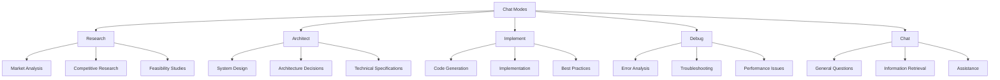
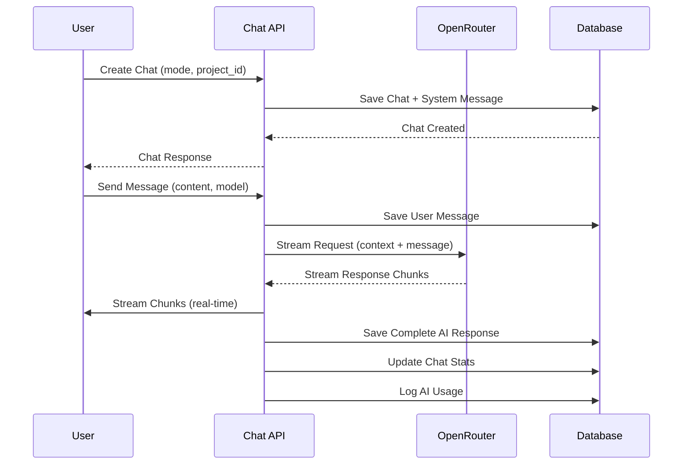
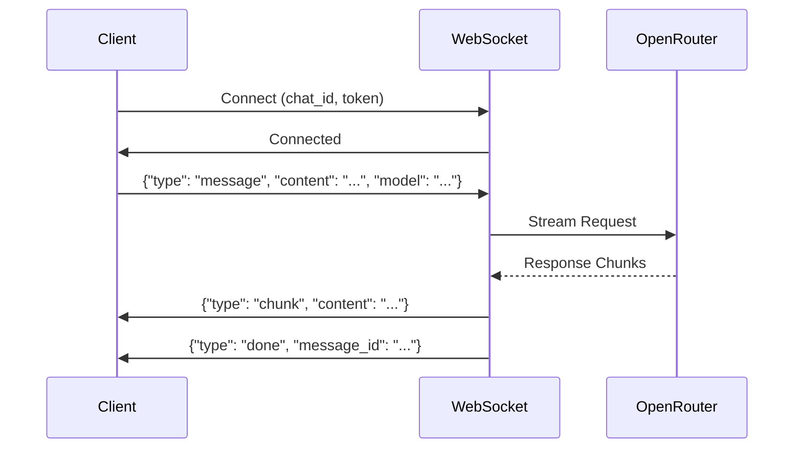
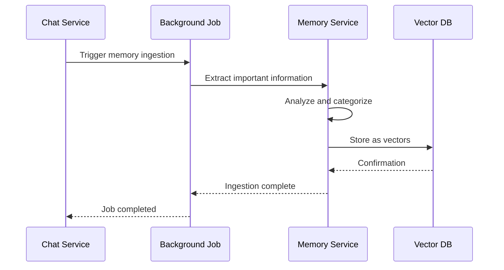

# Chat API Documentation

## Overview

The Chat API provides endpoints for AI-powered conversations with multiple interaction modes, real-time streaming, project integration, and comprehensive cost tracking. Chats can be personal or project-specific, with different AI modes optimized for various use cases like research, architecture, implementation, and debugging.

## Base URL

```
/api/v1/chats
```

## Authentication

All Chat API endpoints require authentication via JWT token. Include the token in the Authorization header:

```
Authorization: Bearer <your-jwt-token>
```

## Core Concepts

### Chat Modes

The Chat API supports five distinct AI interaction modes, each optimized for specific use cases:



**Mode Descriptions:**
- **research**: Market research, competitive analysis, feasibility studies
- **architect**: System design, architecture decisions, technical specifications
- **implement**: Code generation, implementation guidance, best practices
- **debug**: Error analysis, troubleshooting, performance optimization
- **chat**: General assistance, information retrieval, conversational AI

### Chat Types

**Personal Chats:**
- Owned by individual users
- No project association
- Full control over chat lifecycle
- Personal AI usage tracking

**Project Chats:**
- Associated with specific projects
- Project context automatically loaded
- Shared with project members
- Project-based cost tracking

### Message Flow



### Cost Management

- **Daily Budget**: $2.00 default per user
- **Real-time Tracking**: Token and cost monitoring
- **Budget Enforcement**: Block at 100%, warning at 90%
- **Usage Analytics**: Detailed cost breakdown by model

## Endpoints

### 1. Create Chat

**POST** `/`

Creates a new chat session with specified mode and optional project association.

#### Request

```json
{
  "mode": "research",
  "project_id": "123e4567-e89b-12d3-a456-426614174000"
}
```

#### Request Fields

**Required:**
- `mode` (string): Chat mode
  - Values: `research`, `architect`, `implement`, `debug`, `chat`

**Optional:**
- `project_id` (UUID): Associated project ID for project-specific chats

#### Response

```json
{
  "id": "123e4567-e89b-12d3-a456-426614174001",
  "title": "New Chat",
  "mode": "research",
  "created_at": "2025-11-15T10:00:00Z",
  "updated_at": "2025-11-15T10:00:00Z",
  "is_archived": false,
  "project_id": "123e4567-e89b-12d3-a456-426614174000",
  "total_tokens": 0,
  "total_cost": 0.0
}
```

#### Error Responses

- `400`: Invalid chat mode, insufficient project permissions
- `404`: Project not found
- `401`: Authentication required
- `500`: Internal server error

---

### 2. Send Message

**POST** `/{chat_id}/messages`

Sends a message to chat and streams AI response in real-time.

#### Request

```json
{
  "content": "Analyze the competitive landscape for AI-powered project management tools and identify key market opportunities",
  "model": "anthropic/claude-sonnet-4.5"
}
```

#### Path Parameters

- `chat_id` (UUID): Chat ID

#### Request Fields

**Required:**
- `content` (string, 1-50000 chars): Message content
- `model` (string, 1-100 chars): AI model to use

#### Response

**Streaming Response** (Server-Sent Events):
```
data: {"type": "chunk", "content": "I'll analyze the competitive landscape for AI-powered project management tools..."}
data: {"type": "chunk", "content": "The market for AI-powered project management tools is rapidly evolving..."}
data: {"type": "chunk", "content": "Key competitors include Linear, Jira, Notion, and Asana..."}
data: {"type": "done", "message_id": "msg-uuid", "tokens": 1250, "cost": 0.075}
```

#### Error Responses

- `400`: Invalid content, model not supported
- `403`: Insufficient permissions (not chat owner)
- `404`: Chat not found
- `402`: Budget exceeded
- `500`: Internal server error, AI service error

---

### 3. Get Chat History

**GET** `/{chat_id}/history`

Retrieves paginated message history for a chat.

#### Path Parameters

- `chat_id` (UUID): Chat ID

#### Query Parameters

- `skip` (integer, default: 0, ≥0): Number of messages to skip
- `limit` (integer, default: 100, 1-100): Maximum messages to return

#### Response

```json
[
  {
    "id": "msg-uuid-1",
    "role": "system",
    "content": "You are a research assistant. Your role is to help users conduct thorough research...",
    "created_at": "2025-11-15T10:00:00Z",
    "ai_model": null,
    "tokens_input": null,
    "tokens_output": null,
    "cost": null,
    "message_metadata": null
  },
  {
    "id": "msg-uuid-2",
    "role": "user",
    "content": "Analyze the competitive landscape for AI-powered project management tools...",
    "created_at": "2025-11-15T10:01:00Z",
    "ai_model": null,
    "tokens_input": null,
    "tokens_output": null,
    "cost": null,
    "message_metadata": null
  },
  {
    "id": "msg-uuid-3",
    "role": "assistant",
    "content": "I'll analyze the competitive landscape for AI-powered project management tools...",
    "created_at": "2025-11-15T10:01:30Z",
    "ai_model": "anthropic/claude-sonnet-4.5",
    "tokens_input": 850,
    "tokens_output": 400,
    "cost": 0.075,
    "message_metadata": {"streamed": true}
  }
]
```

#### Error Responses

- `403`: Insufficient permissions (not chat owner)
- `404`: Chat not found
- `401`: Authentication required
- `500`: Internal server error

---

### 4. Get User Chats

**GET** `/`

Retrieves all chats for the authenticated user, optionally filtered by project.

#### Query Parameters

- `project_id` (UUID, optional): Filter by project ID

#### Response

```json
[
  {
    "id": "123e4567-e89b-12d3-a456-426614174001",
    "title": "Competitive Analysis Research",
    "mode": "research",
    "created_at": "2025-11-15T10:00:00Z",
    "updated_at": "2025-11-15T10:15:30Z",
    "is_archived": false,
    "project_id": "123e4567-e89b-12d3-a456-426614174000",
    "total_tokens": 2500,
    "total_cost": 0.15
  },
  {
    "id": "123e4567-e89b-12d3-a456-426614174002",
    "title": "System Architecture Design",
    "mode": "architect",
    "created_at": "2025-11-14T15:30:00Z",
    "updated_at": "2025-11-14T16:45:00Z",
    "is_archived": false,
    "project_id": null,
    "total_tokens": 3200,
    "total_cost": 0.24
  }
]
```

#### Error Responses

- `401`: Authentication required
- `500`: Internal server error

---

### 5. Get Chat Summary

**GET** `/{chat_id}`

Retrieves comprehensive chat summary with statistics and recent messages.

#### Path Parameters

- `chat_id` (UUID): Chat ID

#### Response

```json
{
  "chat": {
    "id": "123e4567-e89b-12d3-a456-426614174001",
    "title": "Competitive Analysis Research",
    "mode": "research",
    "created_at": "2025-11-15T10:00:00Z",
    "updated_at": "2025-11-15T10:15:30Z",
    "is_archived": false,
    "project_id": "123e4567-e89b-12d3-a456-426614174000",
    "total_tokens": 2500,
    "total_cost": 0.15
  },
  "message_stats": {
    "total_messages": 8,
    "user_messages": 3,
    "assistant_messages": 4,
    "system_messages": 1,
    "total_tokens": 2500,
    "total_cost": 0.15
  },
  "recent_messages": [
    {
      "id": "msg-uuid-8",
      "role": "assistant",
      "content": "Based on my analysis, the key market opportunities include...",
      "created_at": "2025-11-15T10:15:30Z",
      "ai_model": "anthropic/claude-sonnet-4.5"
    },
    {
      "id": "msg-uuid-7",
      "role": "user",
      "content": "What are the key differentiators in this market?",
      "created_at": "2025-11-15T10:12:00Z",
      "ai_model": null
    }
  ]
}
```

#### Error Responses

- `403`: Insufficient permissions (not chat owner)
- `404`: Chat not found
- `401`: Authentication required
- `500`: Internal server error

---

### 6. Archive Chat

**POST** `/{chat_id}/archive`

Archives a chat (soft delete) to hide from default views while preserving data.

#### Path Parameters

- `chat_id` (UUID): Chat ID

#### Response

```json
{
  "id": "123e4567-e89b-12d3-a456-426614174001",
  "title": "Competitive Analysis Research",
  "mode": "research",
  "created_at": "2025-11-15T10:00:00Z",
  "updated_at": "2025-11-15T10:20:00Z",
  "is_archived": true,
  "project_id": "123e4567-e89b-12d3-a456-426614174000",
  "total_tokens": 2500,
  "total_cost": 0.15
}
```

#### Error Responses

- `403`: Insufficient permissions (not chat owner)
- `404`: Chat not found
- `401`: Authentication required
- `500`: Internal server error

---

### 7. Delete Chat

**DELETE** `/{chat_id}`

Permanently deletes a chat and all associated messages.

#### Path Parameters

- `chat_id` (UUID): Chat ID

#### Response

```json
{
  "message": "Chat deleted successfully"
}
```

#### Error Responses

- `403`: Insufficient permissions (not chat owner)
- `404`: Chat not found
- `401`: Authentication required
- `500`: Internal server error

## WebSocket Integration

### Real-time Chat Streaming

**WebSocket Endpoint**: `GET /api/v1/chats/{chat_id}/ws`

Provides real-time bidirectional communication for chat sessions with streaming responses.

#### Connection Parameters

- `chat_id` (UUID): Chat ID to connect to
- `token` (string, query parameter): JWT authentication token

#### Message Format

**Send Message:**
```json
{
  "type": "message",
  "content": "Your message here",
  "model": "anthropic/claude-sonnet-4.5"
}
```

**Receive Response:**
```json
{
  "type": "chunk",
  "content": "Partial response content..."
}
```

```json
{
  "type": "done",
  "message_id": "msg-uuid",
  "tokens": 1250,
  "cost": 0.075
}
```

#### Connection Flow



#### Error Handling

- **4004**: Chat not found
- **4003**: Insufficient permissions
- **4001**: Authentication failed
- **Connection Drops**: Automatic reconnection support

## Chat Modes in Detail

### Research Mode

**Purpose**: Market research, competitive analysis, feasibility studies

**System Prompt**:
```
You are a research assistant. Your role is to help users conduct thorough research,
analyze information, and provide well-structured insights. You should:
- Ask clarifying questions to understand research needs
- Provide comprehensive, evidence-based responses
- Cite sources and reference materials when relevant
- Suggest additional research directions
- Maintain objectivity and avoid bias
- Structure information clearly with headings and bullet points
```

**Use Cases**:
- Market analysis and sizing
- Competitive landscape research
- Technology feasibility studies
- Industry trend analysis
- User research insights

**Best Models**: Claude Sonnet 4.5, Claude Opus 4.1

---

### Architect Mode

**Purpose**: System design, architecture decisions, technical specifications

**System Prompt**:
```
You are a software architect. Your role is to help design robust, scalable systems
and make architectural decisions. You should:
- Analyze requirements and constraints thoroughly
- Consider scalability, performance, and maintainability
- Suggest appropriate technologies and patterns
- Identify potential risks and trade-offs
- Provide clear architectural diagrams and explanations
- Consider security, reliability, and cost implications
- Recommend best practices and industry standards
```

**Use Cases**:
- System architecture design
- Technology stack selection
- Database schema design
- API design and specifications
- Security architecture planning

**Best Models**: Claude Sonnet 4.5, Claude Opus 4.1

---

### Implement Mode

**Purpose**: Code generation, implementation guidance, best practices

**System Prompt**:
```
You are an expert developer. Your role is to help write high-quality,
production-ready code. You should:
- Write clean, well-documented, and maintainable code
- Follow established patterns and best practices
- Consider error handling and edge cases
- Optimize for performance and readability
- Include relevant tests when appropriate
- Explain complex logic and design decisions
- Suggest improvements and optimizations
```

**Use Cases**:
- Code generation and implementation
- Code review and optimization
- Best practices guidance
- Debugging implementation issues
- Test writing strategies

**Best Models**: Claude Sonnet 4.5, GLM 4.6

---

### Debug Mode

**Purpose**: Error analysis, troubleshooting, performance optimization

**System Prompt**:
```
You are a debugging expert. Your role is to help identify, analyze, and
resolve issues in code and systems. You should:
- Systematically analyze problems and symptoms
- Identify root causes and contributing factors
- Provide step-by-step debugging approaches
- Suggest diagnostic tools and techniques
- Explain technical concepts clearly
- Recommend preventive measures
- Help verify fixes and solutions
```

**Use Cases**:
- Error analysis and resolution
- Performance troubleshooting
- System debugging
- Log analysis
- Issue prevention strategies

**Best Models**: Claude Sonnet 4.5, GLM 4.6

---

### Chat Mode

**Purpose**: General assistance, information retrieval, conversational AI

**System Prompt**:
```
You are a helpful AI assistant. Your role is to provide accurate, thoughtful,
and useful responses to user questions. You should:
- Understand the user's intent and context
- Provide clear, concise, and accurate information
- Ask follow-up questions when needed
- Admit uncertainty and suggest verification
- Maintain a helpful and professional tone
- Structure responses for maximum clarity
```

**Use Cases**:
- General questions and answers
- Information retrieval
- Learning and education
- Creative assistance
- General problem-solving

**Best Models**: Claude Sonnet 4.5, GLM 4.6, Gemini Flash

## Cost Management

### Budget System

**Daily Budget**: $2.00 per user (configurable)

**Budget Enforcement**:
- **90% Warning**: Log warning when approaching limit
- **100% Block**: Block new messages when budget exceeded
- **Real-time Tracking**: Monitor usage during chat sessions

### Cost Calculation

**Token-based Pricing**:
- Input tokens: Charged per model rates
- Output tokens: Charged per model rates
- Total cost: Sum of all message costs

**Model Pricing Examples**:
- Claude Sonnet 4.5: $3.00 input / $15.00 output per 1M tokens
- Claude Opus 4.1: $15.00 input / $75.00 output per 1M tokens
- GLM 4.6: ~$0.50 input / $1.50 output per 1M tokens
- Gemini Flash: $0.075 input / $0.30 output per 1M tokens

### Usage Analytics

**Tracking Metrics**:
- Total tokens used (input/output)
- Total cost incurred
- Messages per chat
- Model usage distribution
- Daily/monthly spending

**Cost Optimization**:
- Model selection based on task complexity
- Prompt caching for repeated contexts
- Efficient context management
- Budget alerts and warnings

## Memory Integration

### Automatic Memory Ingestion

**Trigger Conditions**:
- Chat has 10+ messages
- Significant content generated
- User manually triggers ingestion

**Ingestion Process**:


**Memory Types**:
- **Decisions**: Key decisions made in chat
- **Insights**: Important insights and conclusions
- **Code Snippets**: Relevant code examples
- **Patterns**: Reusable patterns and approaches

### Context Retrieval

**Automatic Context Loading**:
- Project-specific context for project chats
- User preferences and history
- Relevant past conversations
- Organizational knowledge base

**Context Optimization**:
- Hierarchical context loading
- Token budget management
- Relevance scoring
- Dynamic context adjustment

## Project Integration

### Project-Specific Chats

**Benefits**:
- Automatic project context loading
- Shared access for team members
- Project-based cost tracking
- Integration with project tasks

**Context Sources**:
- Project description and goals
- Task lists and milestones
- Team member information
- Technical specifications
- Git repository information

### Permission Model

**Access Control**:
- **Personal Chats**: Owner-only access
- **Project Chats**: Project member access
- **Viewer Role**: Read-only access to project chats
- **Member Role**: Full access to project chats

**Permission Checks**:
- Verify project membership
- Check role-based permissions
- Enforce ownership for personal chats
- Validate access for each operation

## Rate Limiting

### Chat Rate Limits

**Default Limits**:
- **Messages per minute**: 10
- **Messages per hour**: 100
- **Daily message limit**: 500

**Rate Limit Headers**:
```
X-RateLimit-Limit: 100
X-RateLimit-Remaining: 95
X-RateLimit-Reset: 1638360000
```

**Exceeded Response**:
```json
{
  "detail": "Rate limit exceeded. Please try again later.",
  "retry_after": 60
}
```

### Rate Limit Strategy

**Sliding Window**: Track requests in time windows
**User-based Limits**: Per-user rate limiting
**Burst Handling**: Allow short bursts within limits
**Graceful Degradation**: Queue requests during high load

## Security and Privacy

### Data Protection

**Encryption**:
- Messages encrypted at rest
- Secure WebSocket connections (WSS)
- JWT token authentication
- API request encryption

**Privacy Controls**:
- User-owned chat data
- Project-based isolation
- No cross-user data access
- Optional data retention policies

### Access Control

**Authentication**:
- JWT token required for all operations
- Token validation on each request
- WebSocket authentication via query parameter
- Automatic token refresh

**Authorization**:
- Chat ownership verification
- Project permission checks
- Role-based access control
- Resource-level permissions

### Content Safety

**Input Validation**:
- Content length limits (50K chars)
- Malicious content detection
- Prompt injection protection
- Input sanitization

**Output Filtering**:
- Sensitive information redaction
- Personal data protection
- Content moderation
- Safe response generation

## Performance Optimization

### Streaming Architecture

**Real-time Streaming**:
- Server-Sent Events for HTTP streaming
- WebSocket for bidirectional communication
- Chunked response delivery
- Progressive content rendering

**Performance Benefits**:
- Reduced perceived latency
- Better user experience
- Early content visibility
- Interruptible responses

### Caching Strategy

**Response Caching**:
- Cache similar responses
- Prompt caching for repeated contexts
- Model response caching
- User preference caching

**Database Optimization**:
- Efficient message pagination
- Indexed chat queries
- Optimized token counting
- Connection pooling

### Resource Management

**Memory Management**:
- Efficient context loading
- Token budget optimization
- Memory cleanup for archived chats
- Resource pooling for AI requests

**Connection Management**:
- WebSocket connection pooling
- Connection lifecycle management
- Automatic reconnection handling
- Graceful degradation

## Best Practices

### Chat Creation

1. **Choose Appropriate Mode**: Select mode based on task type
2. **Project Association**: Link to relevant projects for context
3. **Clear Objectives**: Start with clear goals and requirements
4. **Context Setup**: Provide relevant background information
5. **Budget Awareness**: Monitor usage and costs

### Message Composition

1. **Clear and Specific**: Provide detailed, specific requests
2. **Context Inclusion**: Include relevant background and constraints
3. **Structured Queries**: Use well-organized, structured questions
4. **Iterative Refinement**: Build on previous responses
5. **Feedback Loop**: Provide feedback on AI responses

### Cost Management

1. **Model Selection**: Choose appropriate models for tasks
2. **Efficient Prompts**: Write concise, effective prompts
3. **Context Optimization**: Minimize unnecessary context
4. **Budget Monitoring**: Track usage and set limits
5. **Cost Review**: Regular cost analysis and optimization

### Project Integration

1. **Relevant Projects**: Link chats to appropriate projects
2. **Team Collaboration**: Use project chats for team discussions
3. **Context Utilization**: Leverage project context effectively
4. **Permission Management**: Manage access appropriately
5. **Knowledge Sharing**: Share insights with team members

## Integration Examples

### Basic Chat Creation

```python
# Create a research chat for competitive analysis
response = requests.post(
    f"{API_BASE}/chats",
    json={
        "mode": "research",
        "project_id": "project-uuid"
    },
    headers={"Authorization": f"Bearer {token}"}
)

chat = response.json()
chat_id = chat["id"]
print(f"Created chat: {chat['title']} ({chat['mode']})")
```

### Streaming Message Exchange

```python
# Send message and stream response
response = requests.post(
    f"{API_BASE}/chats/{chat_id}/messages",
    json={
        "content": "Analyze the competitive landscape for AI project management tools",
        "model": "anthropic/claude-sonnet-4.5"
    },
    headers={"Authorization": f"Bearer {token}"},
    stream=True
)

# Process streaming response
full_response = ""
for line in response.iter_lines():
    if line:
        line = line.decode('utf-8')
        if line.startswith('data: '):
            data = json.loads(line[6:])
            if data.get('type') == 'chunk':
                chunk = data['content']
                full_response += chunk
                print(chunk, end='', flush=True)
            elif data.get('type') == 'done':
                print(f"\n\nTokens: {data['tokens']}, Cost: ${data['cost']}")
                break

print(f"\nFull response: {full_response}")
```

### WebSocket Integration

```javascript
// WebSocket connection for real-time chat
const ws = new WebSocket(
    `ws://localhost:8000/api/v1/chats/${chatId}/ws?token=${token}`
);

ws.onopen = () => {
    console.log('Connected to chat');

    // Send message
    ws.send(JSON.stringify({
        type: 'message',
        content: 'Help me design a scalable microservices architecture',
        model: 'anthropic/claude-sonnet-4.5'
    }));
};

ws.onmessage = (event) => {
    const data = JSON.parse(event.data);

    if (data.type === 'chunk') {
        console.log(data.content);
    } else if (data.type === 'done') {
        console.log(`Complete. Tokens: ${data.tokens}, Cost: $${data.cost}`);
    }
};

ws.onerror = (error) => {
    console.error('WebSocket error:', error);
};

ws.onclose = () => {
    console.log('Disconnected from chat');
};
```

### Chat History Management

```python
# Get chat history with pagination
response = requests.get(
    f"{API_BASE}/chats/{chat_id}/history",
    params={"skip": 0, "limit": 50},
    headers={"Authorization": f"Bearer {token}"}
)

messages = response.json()
for message in messages:
    print(f"[{message['role']}] {message['created_at']}")
    print(f"{message['content'][:100]}...")
    if message['tokens_input']:
        print(f"Tokens: {message['tokens_input']}+{message['tokens_output']}, Cost: ${message['cost']}")
    print()

# Get chat summary
response = requests.get(
    f"{API_BASE}/chats/{chat_id}",
    headers={"Authorization": f"Bearer {token}"}
)

summary = response.json()
print(f"Chat: {summary['chat']['title']}")
print(f"Mode: {summary['chat']['mode']}")
print(f"Stats: {summary['message_stats']['total_messages']} messages, ${summary['chat']['total_cost']} total")
```

### Multi-Mode Chat Workflow

```python
# Research phase
research_chat = requests.post(
    f"{API_BASE}/chats",
    json={"mode": "research"},
    headers={"Authorization": f"Bearer {token}"}
).json()

# Architecture phase
architect_chat = requests.post(
    f"{API_BASE}/chats",
    json={"mode": "architect", "project_id": project_id},
    headers={"Authorization": f"Bearer {token}"}
).json()

# Implementation phase
implement_chat = requests.post(
    f"{API_BASE}/chats",
    json={"mode": "implement", "project_id": project_id},
    headers={"Authorization": f"Bearer {token}"}
).json()

print(f"Created workflow chats:")
print(f"Research: {research_chat['id']}")
print(f"Architect: {architect_chat['id']}")
print(f"Implement: {implement_chat['id']}")
```

## Troubleshooting

### Common Issues

1. **WebSocket Connection Failed**
   - Check JWT token validity
   - Verify chat ownership
   - Ensure WebSocket URL is correct
   - Check network connectivity

2. **Streaming Response Interrupted**
   - Check network stability
   - Verify server health
   - Check rate limits
   - Review error logs

3. **Budget Exceeded**
   - Check daily usage statistics
   - Wait for budget reset (daily)
   - Use more efficient models
   - Optimize prompt length

4. **Chat Not Found**
   - Verify chat ID format
   - Check user permissions
   - Confirm chat exists
   - Check if chat was deleted

### Debug Information

**Enable Debug Logging**:
```python
# Check chat permissions
response = requests.get(
    f"{API_BASE}/chats/{chat_id}",
    headers={"Authorization": f"Bearer {token}"}
)

if response.status_code == 403:
    print("Permission denied - check chat ownership")
elif response.status_code == 404:
    print("Chat not found - verify chat ID")
```

**Monitor Usage**:
```python
# Check daily usage
from datetime import date, timedelta

today = date.today()
response = requests.get(
    f"{API_BASE}/ai-usage/daily/{today}",
    headers={"Authorization": f"Bearer {token}"}
)

usage = response.json()
print(f"Daily usage: ${usage['total_cost']}")
print(f"Messages: {usage['message_count']}")
```

### Performance Optimization

- **Use Efficient Models**: Choose appropriate models for tasks
- **Optimize Prompts**: Write concise, effective prompts
- **Manage Context**: Limit unnecessary context loading
- **Monitor Costs**: Track and optimize spending
- **Cache Responses**: Cache repeated queries when possible

## Version History

- **v1.0**: Basic chat functionality with streaming
- **v1.1**: Added multiple chat modes and project integration
- **v1.2**: Enhanced cost tracking and budget management
- **v1.3**: WebSocket support for real-time communication
- **v1.4**: Memory integration and context optimization
- **v1.5**: Rate limiting and performance improvements

## Support

For chat API issues:
1. Check authentication and permissions
2. Verify chat ownership and project access
3. Review rate limits and budget status
4. Check WebSocket connection status
5. Monitor error logs and response codes
6. Contact support with chat ID and error details
