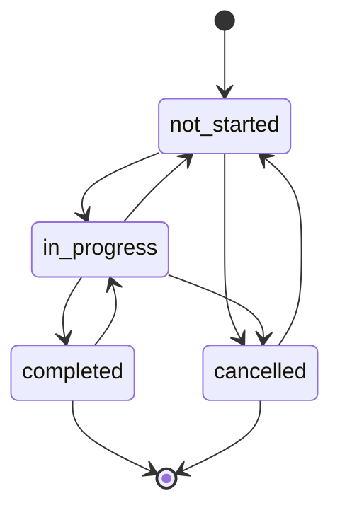

# Milestone API Documentation

## Overview

The Milestone API provides endpoints for managing project milestones, which represent major goals, phases, or releases within a project. Milestones help organize tasks into meaningful groups, provide roadmap visualization, and enable progress tracking at a higher level than individual tasks.

## Base URL

```
/api/v1/milestones
```

## Authentication

All Milestone API endpoints require authentication via JWT token. Include the token in the Authorization header:

```
Authorization: Bearer <your-jwt-token>
```

## Core Concepts

### Milestone Structure

Each milestone contains:
- **Basic Info**: Name, description, color for UI display
- **Status**: Current state in the workflow
- **Dates**: Start date, due date, completion timestamp
- **Progress**: Manual or auto-calculated progress percentage
- **Order**: Display order for drag-drop sorting

### Milestone Statuses

- `not_started`: Initial state, work hasn't begun
- `in_progress`: Active work in progress
- `completed`: All work finished, completion timestamp set
- `cancelled`: Milestone cancelled, no longer active

### Progress Calculation

- **Manual Progress**: Set directly via API (0-100%)
- **Auto Progress**: Calculated from task completion: `(completed_tasks / total_tasks) * 100`
- **Default**: 0% when no tasks exist

### Ordering System

- Each milestone has an `order` field (integer, unique per project)
- Supports drag-drop reordering with automatic collision handling
- Default order assigned automatically on creation

## Endpoints

### 1. Create Milestone

**POST** `/projects/{project_id}/milestones`

Creates a new milestone for a project.

#### Request

```json
{
  "name": "Phase 1: Backend Development",
  "description": "Implement core backend APIs and database schema",
  "status": "not_started",
  "color": "#3b82f6",
  "start_date": "2025-11-15T00:00:00Z",
  "due_date": "2025-12-15T00:00:00Z",
  "order": 1
}
```

#### Path Parameters

- `project_id` (UUID): Project ID to associate the milestone with

#### Request Fields

- `name` (string, required): Milestone display name (1-255 chars)
- `description` (string, optional): Detailed description
- `status` (string, default: "not_started"): Initial status
  - Values: `not_started`, `in_progress`, `completed`, `cancelled`
- `color` (string, default: "#3b82f6"): Hex color code
- `start_date` (datetime, optional): Start date
- `due_date` (datetime, optional): Target completion date
- `order` (integer, optional): Display order (auto-assigned if not provided)

#### Response

```json
{
  "id": "123e4567-e89b-12d3-a456-426614174000",
  "project_id": "123e4567-e89b-12d3-a456-426614174001",
  "name": "Phase 1: Backend Development",
  "description": "Implement core backend APIs and database schema",
  "status": "not_started",
  "color": "#3b82f6",
  "start_date": "2025-11-15T00:00:00Z",
  "due_date": "2025-12-15T00:00:00Z",
  "completed_at": null,
  "progress_percentage": 0,
  "order": 1,
  "created_at": "2025-11-15T10:00:00Z",
  "updated_at": "2025-11-15T10:00:00Z",
  "is_overdue": false,
  "days_remaining": 30
}
```

#### Error Responses

- `400`: Validation error or invalid data
- `403`: Forbidden (insufficient permissions)
- `404`: Project not found
- `422`: Unprocessable entity (validation errors)

---

### 2. List Project Milestones

**GET** `/projects/{project_id}/milestones`

Retrieves milestones for a project with pagination and optional filtering.

#### Query Parameters

- `skip` (integer, default: 0): Pagination offset
- `limit` (integer, default: 100, max: 100): Page size
- `status` (string, optional): Filter by status
  - Values: `not_started`, `in_progress`, `completed`, `cancelled`

#### Response

```json
{
  "milestones": [
    {
      "id": "123e4567-e89b-12d3-a456-426614174000",
      "project_id": "123e4567-e89b-12d3-a456-426614174001",
      "name": "Phase 1: Backend Development",
      "status": "not_started",
      "color": "#3b82f6",
      "due_date": "2025-12-15T00:00:00Z",
      "completed_at": null,
      "progress_percentage": 0,
      "order": 1,
      "created_at": "2025-11-15T10:00:00Z",
      "updated_at": "2025-11-15T10:00:00Z",
      "is_overdue": false,
      "days_remaining": 30
    }
  ],
  "total": 1
}
```

#### Error Responses

- `403`: Forbidden (insufficient permissions)
- `404`: Project not found

---

### 3. Get Milestone Details

**GET** `/{milestone_id}`

Retrieves detailed information about a specific milestone.

#### Path Parameters

- `milestone_id` (UUID): Milestone ID

#### Response

Same as Create Milestone response with all fields populated.

#### Error Responses

- `403`: Forbidden (insufficient permissions)
- `404`: Milestone not found

---

### 4. Update Milestone

**PATCH** `/{milestone_id}`

Updates milestone fields. All fields are optional for partial updates.

#### Request

```json
{
  "name": "Updated Phase 1: Backend Development",
  "description": "Updated description",
  "status": "in_progress",
  "color": "#10b981",
  "due_date": "2025-12-20T00:00:00Z",
  "progress_percentage": 45,
  "order": 2
}
```

#### Path Parameters

- `milestone_id` (UUID): Milestone ID

#### Request Fields (All Optional)

- `name` (string): New milestone name
- `description` (string): New description
- `status` (string): New status
- `color` (string): New hex color code
- `start_date` (datetime): New start date
- `due_date` (datetime): New due date
- `progress_percentage` (integer): New progress (0-100)
- `order` (integer): New display order

#### Response

Updated milestone object with new values.

#### Error Responses

- `400`: Validation error
- `403`: Forbidden (insufficient permissions)
- `404`: Milestone not found

---

### 5. Delete Milestone

**DELETE** `/{milestone_id}`

Deletes a milestone permanently. Cannot delete milestones with linked tasks.

#### Path Parameters

- `milestone_id` (UUID): Milestone ID

#### Response

```json
{
  "message": "Milestone deleted successfully"
}
```

#### Error Responses

- `400`: Cannot delete milestone with linked tasks
- `403`: Forbidden (insufficient permissions)
- `404`: Milestone not found

---

### 6. Update Milestone Status

**PATCH** `/{milestone_id}/status`

Updates milestone status with validation and automatic timestamp management.

#### Request

```json
{
  "status": "in_progress"
}
```

#### Path Parameters

- `milestone_id` (UUID): Milestone ID

#### Request Fields

- `status` (string, required): New status
  - Values: `not_started`, `in_progress`, `completed`, `cancelled`

#### Valid Status Transitions

- `not_started` → `in_progress`, `cancelled`
- `in_progress` → `completed`, `not_started`, `cancelled`
- `completed` → `in_progress` (reopen)
- `cancelled` → `not_started` (uncancel)

#### Response

Updated milestone with new status and automatic `completed_at` timestamp if status is `completed`.

#### Error Responses

- `400`: Invalid status transition
- `403`: Forbidden (insufficient permissions)
- `404`: Milestone not found

---

### 7. Update Milestone Progress

**PATCH** `/{milestone_id}/progress`

Manually sets milestone progress percentage.

#### Request

```json
{
  "progress_percentage": 75
}
```

#### Path Parameters

- `milestone_id` (UUID): Milestone ID

#### Request Fields

- `progress_percentage` (integer, required): Progress value (0-100)

#### Response

Updated milestone with new progress percentage.

#### Error Responses

- `400`: Invalid progress value
- `403`: Forbidden (insufficient permissions)
- `404`: Milestone not found

---

### 8. Recalculate Progress

**POST** `/{milestone_id}/recalculate`

Auto-calculates progress from task completion status.

#### Path Parameters

- `milestone_id` (UUID): Milestone ID

#### Calculation Formula

```
progress = (completed_tasks / total_tasks) * 100
```

Returns 0 if no tasks exist.

#### Response

Updated milestone with auto-calculated progress.

#### Error Responses

- `404`: Milestone not found

---

### 9. Reorder Milestone

**PATCH** `/{milestone_id}/reorder`

Changes milestone display order for drag-drop UI functionality.

#### Request

```json
{
  "new_order": 3
}
```

#### Path Parameters

- `milestone_id` (UUID): Milestone ID

#### Request Fields

- `new_order` (integer, required): New order value (>= 0)

#### Features

- Automatically shifts other milestones to make room
- Maintains unique order within project
- Handles order collision automatically

#### Response

Updated milestone with new order value.

#### Error Responses

- `400`: Invalid order value
- `403`: Forbidden (insufficient permissions)
- `404`: Milestone not found

---

### 10. Get Milestone Summary

**GET** `/{milestone_id}/summary`

Retrieves milestone details with task statistics and progress analytics.

#### Path Parameters

- `milestone_id` (UUID): Milestone ID

#### Response

```json
{
  "milestone": {
    "id": "123e4567-e89b-12d3-a456-426614174000",
    "name": "Phase 1: Backend Development",
    "status": "in_progress",
    "progress_percentage": 45,
    "is_overdue": false,
    "days_remaining": 15
  },
  "task_stats": {
    "todo": 5,
    "in_progress": 3,
    "in_review": 2,
    "done": 8,
    "cancelled": 0
  },
  "total_tasks": 18,
  "completed_tasks": 8,
  "auto_progress": 44
}
```

#### Error Responses

- `403`: Forbidden (insufficient permissions)
- `404`: Milestone not found

---

### 11. Get Project Roadmap

**GET** `/projects/{project_id}/milestones/roadmap`

Retrieves all milestones for roadmap/timeline visualization.

#### Path Parameters

- `project_id` (UUID): Project ID

#### Response

Array of all milestones ordered by display order and dates.

```json
[
  {
    "id": "123e4567-e89b-12d3-a456-426614174000",
    "name": "Phase 1: Backend Development",
    "status": "completed",
    "progress_percentage": 100,
    "order": 1,
    "is_overdue": false,
    "days_remaining": null
  },
  {
    "id": "123e4567-e89b-12d3-a456-426614174001",
    "name": "Phase 2: Frontend Development",
    "status": "in_progress",
    "progress_percentage": 60,
    "order": 2,
    "is_overdue": false,
    "days_remaining": 20
  }
]
```

#### Error Responses

- `403`: Forbidden (insufficient permissions)
- `404`: Project not found

---

### 12. Get Upcoming Milestones

**GET** `/projects/{project_id}/milestones/upcoming`

Retrieves milestones due within the next N days.

#### Query Parameters

- `days` (integer, default: 30, max: 365): Number of days to look ahead

#### Path Parameters

- `project_id` (UUID): Project ID

#### Exclusions

- Completed milestones
- Cancelled milestones
- Milestones without due dates

#### Response

Array of upcoming milestones ordered by due date.

```json
[
  {
    "id": "123e4567-e89b-12d3-a456-426614174001",
    "name": "Phase 2: Frontend Development",
    "status": "in_progress",
    "due_date": "2025-12-05T00:00:00Z",
    "is_overdue": false,
    "days_remaining": 20
  }
]
```

#### Error Responses

- `403`: Forbidden (insufficient permissions)
- `404`: Project not found

## Computed Properties

### is_overdue

Boolean indicating if milestone is past due date.

**Logic:**
- Returns `false` if status is `completed` or `cancelled`
- Returns `false` if no due date is set
- Returns `true` if current time > due date

### days_remaining

Integer days until due date.

**Logic:**
- Returns `null` if status is `completed` or `cancelled`
- Returns `null` if no due date is set
- Returns `0` if overdue
- Returns positive integer if due date is in future

## Permissions

### Project Roles

- **viewer**: Can view milestones
- **member**: Can view, create, update milestones
- **admin**: Can delete milestones, update any milestone

### Operation Permissions

| Operation | Required Role |
|-----------|---------------|
| View milestones | viewer |
| Create milestone | member |
| Update milestone | member |
| Update status | member |
| Update progress | member |
| Reorder milestone | member |
| Delete milestone | admin |

## Status Transition Rules

### Valid Transitions



### Transition Validation

- All transitions must follow the valid paths above
- Invalid transitions return `400 Bad Request`
- Transition to `completed` automatically sets `completed_at`
- Transition from `completed` clears `completed_at`

## Progress Tracking

### Manual Progress

- Set directly via `PATCH /{milestone_id}/progress`
- Overwrites auto-calculated progress
- Range: 0-100

### Auto Progress

- Calculated from linked tasks: `(completed_tasks / total_tasks) * 100`
- Updated via `POST /{milestone_id}/recalculate`
- Returns 0 if no tasks exist
- Used in milestone summary for comparison

### Progress Sources

- `progress_percentage`: Manual progress (stored in database)
- `auto_progress`: Calculated progress (computed on demand)
- Both values available in milestone summary

## Ordering System

### Order Management

- Each milestone has unique `order` within project
- Order starts from 0 and increments
- Auto-assigned on creation if not specified

### Reordering Logic

1. When milestone is moved to `new_order`
2. All milestones at/after `new_order` shift right (+1)
3. Moving milestone left shifts others left (-1)
4. Maintains unique order constraint

### Use Cases

- Drag-drop milestone reordering in UI
- Timeline visualization
- Project planning views

## Date Management

### Date Fields

- `start_date`: Optional milestone start date
- `due_date`: Optional target completion date
- `completed_at`: Auto-set when status → `completed`

### Date Validation

- `due_date` must be after `start_date` if both provided
- All dates stored as UTC with timezone
- ISO 8601 format in API responses

### Date Calculations

- `is_overdue`: Based on `due_date` and current time
- `days_remaining`: Calculated from `due_date`
- Excludes completed/cancelled milestones from overdue checks

## Color System

### Color Format

- Hex color codes: `#RRGGBB`
- 6 characters, case-insensitive
- Default: `#3b82f6` (blue)

### Color Validation

- Regex pattern: `^#[0-9A-Fa-f]{6}$`
- Invalid colors return `400 Bad Request`
- Used for UI visualization and categorization

### Common Colors

- `#3b82f6`: Blue (default)
- `#10b981`: Green (completed)
- `#f59e0b`: Amber (in progress)
- `#ef4444`: Red (overdue/cancelled)
- `#8b5cf6`: Purple (important)

## Error Handling

### Common Error Formats

```json
{
  "detail": "Error message describing the issue"
}
```

### Validation Errors

- Invalid status transitions
- Progress out of range (0-100)
- Invalid color format
- Due date before start date
- Empty milestone names

### Permission Errors

- User not in project
- Insufficient role for operation
- Project access denied

### Business Logic Errors

- Cannot delete milestone with tasks
- Order collision handling
- Milestone not found

## Rate Limiting

- Standard API rate limits apply
- Bulk operations should be spaced out
- Progress recalculation has no limits (system operation)

## Monitoring

### Key Metrics

- Milestone creation rate
- Status transition frequency
- Progress update patterns
- Ordering operations

### Logging Levels

- `INFO`: Milestone lifecycle events
- `WARN`: Permission issues, validation warnings
- `ERROR`: Database errors, business rule violations
- `DEBUG`: Detailed operation information

## Best Practices

### Milestone Creation

1. Use descriptive names with phases/releases
2. Set realistic due dates
3. Include meaningful descriptions
4. Use color coding for visual organization

### Progress Management

1. Use auto-progress for task-based tracking
2. Manual progress for non-task milestones
3. Recalculate progress after task changes
4. Monitor progress vs. timeline

### Status Management

1. Follow valid transition rules
2. Update status when work begins/ends
3. Use cancelled for abandoned milestones
4. Reopen completed milestones if needed

### Ordering

1. Use logical order (chronological or priority)
2. Reorder via API for drag-drop UI
3. Maintain consistent ordering
4. Consider timeline visualization

## Integration Examples

### Creating a Project Roadmap

```python
# Create milestones for project phases
milestones = [
    {
        "name": "Phase 1: Backend Development",
        "due_date": "2025-12-15T00:00:00Z",
        "color": "#3b82f6"
    },
    {
        "name": "Phase 2: Frontend Development",
        "due_date": "2026-01-15T00:00:00Z",
        "color": "#10b981"
    },
    {
        "name": "Phase 3: Testing & Deployment",
        "due_date": "2026-02-15T00:00:00Z",
        "color": "#f59e0b"
    }
]

for i, milestone_data in enumerate(milestones):
    milestone_data["order"] = i
    response = requests.post(
        f"{API_BASE}/projects/{project_id}/milestones",
        json=milestone_data,
        headers={"Authorization": f"Bearer {token}"}
    )
```

### Tracking Progress

```python
# Update milestone progress based on task completion
milestone_id = "milestone-uuid"

# Auto-calculate from tasks
response = requests.post(
    f"{API_BASE}/milestones/{milestone_id}/recalculate",
    headers={"Authorization": f"Bearer {token}"}
)

milestone = response.json()
print(f"Auto progress: {milestone['auto_progress']}%")
print(f"Manual progress: {milestone['progress_percentage']}%")
```

### Roadmap Visualization

```python
# Get project roadmap for timeline view
response = requests.get(
    f"{API_BASE}/projects/{project_id}/milestones/roadmap",
    headers={"Authorization": f"Bearer {token}"}
)

milestones = response.json()
for milestone in milestones:
    print(f"{milestone['name']}: {milestone['progress_percentage']}% complete")
    if milestone['is_overdue']:
        print("  ⚠️ OVERDUE")
    elif milestone['days_remaining'] is not None:
        print(f"  📅 {milestone['days_remaining']} days remaining")
```

## Version History

- **v1.0**: Initial milestone API implementation
- **v1.1**: Added progress recalculation and summary endpoints
- **v1.2**: Enhanced ordering system with collision handling
- **v1.3**: Added roadmap and upcoming milestones views
- **v1.4**: Improved status transition validation

## Support

For issues with the Milestone API:
1. Check the error messages for specific issues
2. Verify project permissions and membership
3. Review status transition rules
4. Contact the development team for persistent issues
