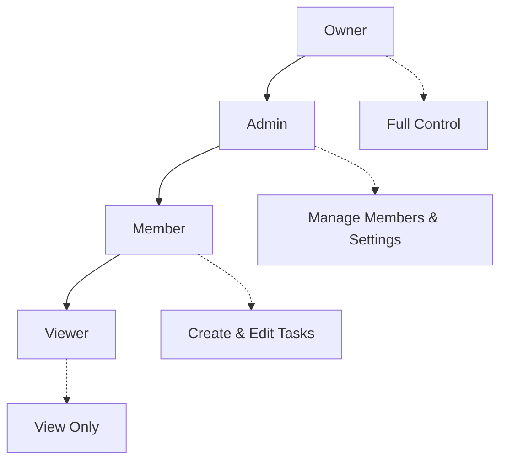
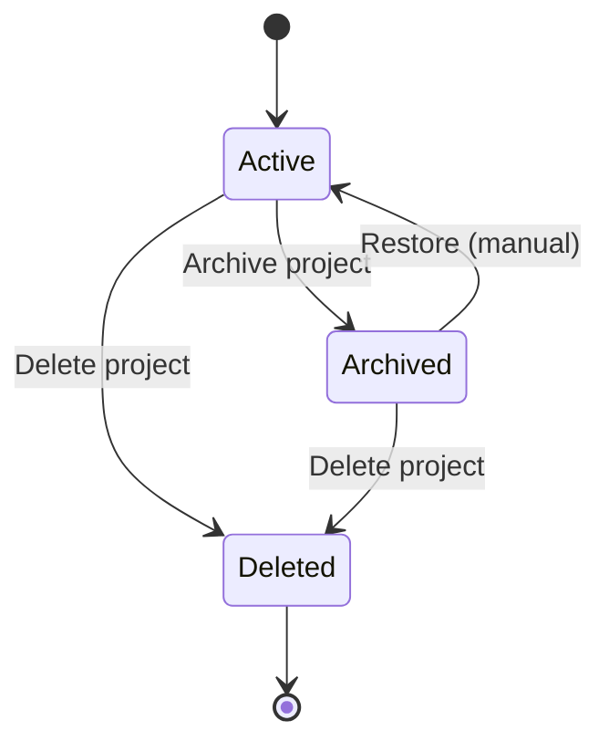
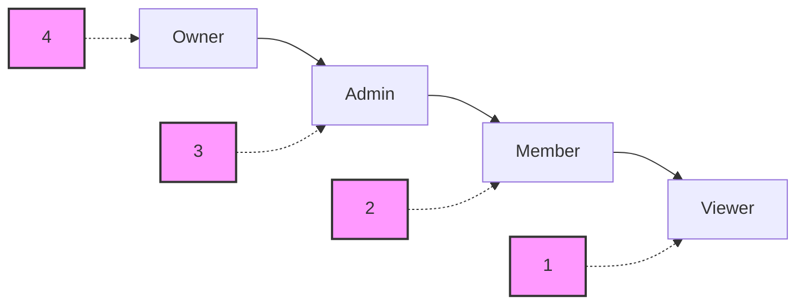

# Project API Documentation

## Overview

The Project API provides endpoints for managing project workspaces, the top-level organizational unit in Ardha. Projects contain tasks, files, team members, and integrate with Git repositories and OpenSpec specifications. The API supports role-based access control, member management, and project lifecycle operations.

## Base URL

```
/api/v1/projects
```

## Authentication

All Project API endpoints require authentication via JWT token. Include the token in the Authorization header:

```
Authorization: Bearer <your-jwt-token>
```

## Core Concepts

### Project Structure

Each project serves as a container for:
- **Tasks**: Work items with dependencies and tracking
- **Team Members**: Users with role-based permissions
- **Git Integration**: Repository linking and branch management
- **OpenSpec**: Specification management and documentation
- **Chat**: Project-specific conversations
- **Milestones**: Timeline and goal tracking
- **AI Usage**: Cost tracking and AI interactions

### Project Visibility Levels

- `private`: Only project members can access (default)
- `team`: All authenticated users can view, members can edit
- `public`: Anyone can view, members can edit

### Role-Based Access Control

Projects use hierarchical permissions:



**Role Permissions:**
- **Owner**: Full control, can delete project, transfer ownership
- **Admin**: Manage members, update settings, cannot delete
- **Member**: Create/edit tasks, view project data
- **Viewer**: Read-only access to project

### Project Slugs

- Auto-generated URL-safe identifiers
- Format: `project-name-123` (lowercase, hyphens, unique suffix)
- Used in URLs and references
- Generated from project name on creation

## Endpoints

### 1. Create Project

**POST** `/`

Creates a new project with the authenticated user as the owner.

#### Request

```json
{
  "name": "AI Project Management Platform",
  "description": "A comprehensive platform for managing AI-powered development projects with integrated workflows and real-time collaboration",
  "visibility": "private",
  "tech_stack": ["Python", "FastAPI", "React", "PostgreSQL", "Redis", "Qdrant"],
  "git_repo_url": "https://github.com/ardhaecosystem/Ardha",
  "git_branch": "main",
  "openspec_enabled": true,
  "openspec_path": "openspec/"
}
```

#### Request Fields

**Required:**
- `name` (string, 1-255 chars): Project name

**Optional:**
- `description` (string): Detailed project description
- `visibility` (string, default: "private"): Access level
  - Values: `private`, `team`, `public`
- `tech_stack` (string array): Technology tags
- `git_repo_url` (string, max 500 chars): Git repository URL
- `git_branch` (string, max 255 chars, default: "main"): Default branch
- `openspec_enabled` (boolean, default: true): Enable OpenSpec
- `openspec_path` (string, max 255 chars, default: "openspec/"): OpenSpec directory

#### Response

```json
{
  "id": "123e4567-e89b-12d3-a456-426614174000",
  "name": "AI Project Management Platform",
  "description": "A comprehensive platform for managing AI-powered development projects...",
  "slug": "ai-project-management-platform-123",
  "owner_id": "123e4567-e89b-12d3-a456-426614174001",
  "visibility": "private",
  "tech_stack": ["Python", "FastAPI", "React", "PostgreSQL", "Redis", "Qdrant"],
  "git_repo_url": "https://github.com/ardhaecosystem/Ardha",
  "git_branch": "main",
  "openspec_enabled": true,
  "openspec_path": "openspec/",
  "is_archived": false,
  "archived_at": null,
  "created_at": "2025-11-15T10:00:00Z",
  "updated_at": "2025-11-15T10:00:00Z",
  "member_count": 1
}
```

#### Error Responses

- `400`: Validation error (name too long, invalid visibility)
- `401`: Authentication required
- `500`: Internal server error

---

### 2. List User Projects

**GET** `/`

Retrieves all projects where the authenticated user is a member.

#### Query Parameters

- `skip` (integer, default: 0, ≥0): Pagination offset
- `limit` (integer, default: 100, 1-100): Page size
- `include_archived` (boolean, default: false): Include archived projects

#### Response

```json
{
  "projects": [
    {
      "id": "123e4567-e89b-12d3-a456-426614174000",
      "name": "AI Project Management Platform",
      "slug": "ai-project-management-platform-123",
      "visibility": "private",
      "tech_stack": ["Python", "FastAPI", "React"],
      "is_archived": false,
      "created_at": "2025-11-15T10:00:00Z",
      "updated_at": "2025-11-15T10:00:00Z",
      "member_count": 5
    },
    {
      "id": "123e4567-e89b-12d3-a456-426614174002",
      "name": "E-commerce Backend",
      "slug": "ecommerce-backend-456",
      "visibility": "team",
      "tech_stack": ["Node.js", "Express", "MongoDB"],
      "is_archived": false,
      "created_at": "2025-10-01T15:30:00Z",
      "updated_at": "2025-11-10T09:15:00Z",
      "member_count": 3
    }
  ],
  "total": 2,
  "skip": 0,
  "limit": 100
}
```

#### Error Responses

- `401`: Authentication required
- `500`: Internal server error

---

### 3. Get Project by ID

**GET** `/{project_id}`

Retrieves detailed project information by UUID.

#### Path Parameters

- `project_id` (UUID): Project ID

#### Response

Same as Create Project response with full details.

#### Error Responses

- `403`: Forbidden (not a project member)
- `404`: Project not found
- `401`: Authentication required

---

### 4. Get Project by Slug

**GET** `/slug/{slug}`

Retrieves project by URL-safe slug identifier.

#### Path Parameters

- `slug` (string): Project slug (e.g., "ai-project-management-platform-123")

#### Response

Same as Get Project by ID response.

#### Error Responses

- `403`: Forbidden (not a project member)
- `404`: Project not found
- `401`: Authentication required

---

### 5. Update Project

**PATCH** `/{project_id}`

Updates project fields. Requires owner or admin role.

#### Request

```json
{
  "name": "Updated AI Project Management Platform",
  "description": "Updated description with new features and capabilities",
  "visibility": "team",
  "tech_stack": ["Python", "FastAPI", "React", "PostgreSQL", "Redis", "Qdrant", "Docker"],
  "git_repo_url": "https://github.com/ardhaecosystem/Ardha-v2",
  "git_branch": "develop",
  "openspec_enabled": true,
  "openspec_path": "specs/"
}
```

#### Path Parameters

- `project_id` (UUID): Project ID

#### Request Fields (All Optional)

Same fields as Create Project, but all optional for partial updates.

#### Response

Updated project object with new values.

#### Error Responses

- `400`: Validation error
- `403`: Forbidden (insufficient permissions)
- `404`: Project not found
- `401`: Authentication required

---

### 6. Archive Project

**POST** `/{project_id}/archive`

Archives a project (soft delete). Requires owner or admin role.

#### Path Parameters

- `project_id` (UUID): Project ID

#### Response

```json
{
  "message": "Project archived successfully"
}
```

#### Error Responses

- `403`: Forbidden (insufficient permissions)
- `404`: Project not found
- `401`: Authentication required

---

### 7. Delete Project

**DELETE** `/{project_id}`

Permanently deletes a project. Requires owner role only.

#### Path Parameters

- `project_id` (UUID): Project ID

#### Response

```json
{
  "message": "Project deleted successfully"
}
```

#### Error Responses

- `403`: Forbidden (not owner)
- `404`: Project not found
- `401`: Authentication required

---

### 8. List Project Members

**GET** `/{project_id}/members`

Retrieves all members of a project with user information.

#### Path Parameters

- `project_id` (UUID): Project ID

#### Response

```json
[
  {
    "id": "member-uuid-1",
    "user_id": "123e4567-e89b-12d3-a456-426614174001",
    "role": "owner",
    "joined_at": "2025-11-15T10:00:00Z",
    "user_email": "owner@example.com",
    "user_username": "projectowner",
    "user_full_name": "Project Owner"
  },
  {
    "id": "member-uuid-2",
    "user_id": "123e4567-e89b-12d3-a456-426614174002",
    "role": "admin",
    "joined_at": "2025-11-15T10:05:00Z",
    "user_email": "admin@example.com",
    "user_username": "adminuser",
    "user_full_name": "Admin User"
  },
  {
    "id": "member-uuid-3",
    "user_id": "123e4567-e89b-12d3-a456-426614174003",
    "role": "member",
    "joined_at": "2025-11-15T10:10:00Z",
    "user_email": "developer@example.com",
    "user_username": "devuser",
    "user_full_name": "Developer User"
  }
]
```

#### Error Responses

- `403`: Forbidden (not a project member)
- `404`: Project not found
- `401`: Authentication required

---

### 9. Add Project Member

**POST** `/{project_id}/members`

Adds a new member to the project. Requires owner or admin role.

#### Request

```json
{
  "user_id": "123e4567-e89b-12d3-a456-426614174004",
  "role": "member"
}
```

#### Path Parameters

- `project_id` (UUID): Project ID

#### Request Fields

- `user_id` (UUID, required): User to add
- `role` (string, required): Role to assign
  - Values: `admin`, `member`, `viewer`
  - Note: Cannot add as `owner` (owner assigned at creation)

#### Response

```json
{
  "id": "member-uuid-4",
  "user_id": "123e4567-e89b-12d3-a456-426614174004",
  "role": "member",
  "joined_at": "2025-11-15T11:00:00Z",
  "user_email": "newmember@example.com",
  "user_username": "newuser",
  "user_full_name": "New Member"
}
```

#### Error Responses

- `400`: User already a member, invalid role
- `403`: Forbidden (insufficient permissions)
- `404`: Project not found
- `401`: Authentication required

---

### 10. Remove Project Member

**DELETE** `/{project_id}/members/{user_id}`

Removes a member from the project. Requires owner or admin role. Cannot remove owner.

#### Path Parameters

- `project_id` (UUID): Project ID
- `user_id` (UUID): User ID to remove

#### Response

```json
{
  "message": "Member removed successfully"
}
```

#### Error Responses

- `400`: Cannot remove owner, user not a member
- `403`: Forbidden (insufficient permissions)
- `404`: Project or member not found
- `401`: Authentication required

---

### 11. Update Member Role

**PATCH** `/{project_id}/members/{user_id}`

Updates a member's role. Requires owner or admin role.

#### Request

```json
{
  "role": "admin"
}
```

#### Path Parameters

- `project_id` (UUID): Project ID
- `user_id` (UUID): User ID to update

#### Request Fields

- `role` (string, required): New role
  - Values: `admin`, `member`, `viewer`
  - Note: Cannot change to `owner`

#### Response

```json
{
  "id": "member-uuid-3",
  "user_id": "123e4567-e89b-12d3-a456-426614174003",
  "role": "admin",
  "joined_at": "2025-11-15T10:10:00Z",
  "user_email": "developer@example.com",
  "user_username": "devuser",
  "user_full_name": "Developer User"
}
```

#### Error Responses

- `400`: Invalid role
- `403`: Forbidden (insufficient permissions)
- `404`: Project or member not found
- `401`: Authentication required

## Project Management

### Project Lifecycle



### Archive vs Delete

**Archive (Soft Delete):**
- Project hidden from default lists
- Data preserved for future restoration
- Can be restored by admin
- Members cannot access archived projects

**Delete (Hard Delete):**
- Permanent removal of all project data
- Cannot be undone
- Requires owner role only
- Cascades to all related data

### Project Settings

**Visibility Levels:**
- `private`: Only members can view/access
- `team`: All authenticated users can view, members can edit
- `public`: Anyone can view, members can edit

**OpenSpec Integration:**
- Enable/disable OpenSpec for project
- Configure OpenSpec directory path
- Link proposals to project tasks
- Archive completed specifications

**Git Integration:**
- Link to Git repository
- Set default branch
- Track commits and pull requests
- Integrate with task management

## Member Management

### Role Hierarchy



**Permission Levels:**
- **Owner (Level 4)**: Full control, can delete project, transfer ownership
- **Admin (Level 3)**: Manage members, update settings, archive project
- **Member (Level 2)**: Create/edit tasks, view project data, add comments
- **Viewer (Level 1)**: Read-only access to project data

### Member Operations

**Adding Members:**
- Owner or admin can add new members
- Cannot add users as `owner` role
- User must exist in the system
- Automatic notification to new member

**Removing Members:**
- Owner or admin can remove members
- Cannot remove the project owner
- Member loses access immediately
- Historical contributions preserved

**Role Updates:**
- Owner or admin can change roles
- Cannot assign `owner` role
- Role changes take effect immediately
- Audit trail maintained

### Permission Checks

The system uses hierarchical permission checking:
```python
# User can perform action if their role level >= required level
user_level = ROLE_HIERARCHY[user_role]
required_level = ROLE_HIERARCHY[required_role]
can_perform = user_level >= required_level
```

## Tech Stack Management

### Technology Tags

Projects can be tagged with technologies:
- **Format**: String array (e.g., `["Python", "FastAPI", "React"]`)
- **Validation**: Strip whitespace, remove empty strings
- **Display**: Used for project discovery and filtering
- **Search**: Indexed for technology-based searches

### Common Tech Stack Categories

**Backend:**
- `Python`, `Node.js`, `Java`, `Go`, `Rust`
- `FastAPI`, `Express`, `Spring Boot`, `Gin`
- `PostgreSQL`, `MongoDB`, `Redis`, `Qdrant`

**Frontend:**
- `React`, `Vue`, `Angular`, `Svelte`
- `TypeScript`, `JavaScript`, `CSS`
- `Tailwind`, `Bootstrap`, `Material-UI`

**Infrastructure:**
- `Docker`, `Kubernetes`, `AWS`, `GCP`
- `Nginx`, `Caddy`, `Traefik`
- `GitHub Actions`, `GitLab CI`

**AI/ML:**
- `LangChain`, `OpenAI`, `Hugging Face`
- `TensorFlow`, `PyTorch`, `Scikit-learn`
- `Qdrant`, `Pinecone`, `Weaviate`

## Git Integration

### Repository Linking

Projects can be linked to Git repositories:
- **URL**: Full repository URL (HTTPS/SSH)
- **Branch**: Default branch for operations
- **Integration**: Track commits, PRs, and releases

### Git Workflow Integration

- **Commit Tracking**: Link commits to tasks
- **Branch Management**: Track feature branches
- **Pull Requests**: Associate PRs with project work
- **Release Management**: Track project releases

### Supported Git Providers

- **GitHub**: Full integration with API
- **GitLab**: Repository and issue tracking
- **Bitbucket**: Basic repository linking
- **Self-hosted**: Custom Git server support

## OpenSpec Integration

### OpenSpec Configuration

Projects can enable OpenSpec for specification management:
- **Enabled**: Boolean flag for OpenSpec support
- **Path**: Directory path for OpenSpec files
- **Integration**: Link specs to tasks and workflows

### OpenSpec Features

- **Proposal Management**: Create and review proposals
- **Task Generation**: Generate tasks from specifications
- **Version Control**: Track specification changes
- **Approval Workflow**: Review and approve specifications

### OpenSpec Directory Structure

```
openspec/
├── changes/          # Active proposals
├── archive/          # Completed proposals
├── templates/        # Proposal templates
└── config/          # OpenSpec configuration
```

## Search and Discovery

### Project Search

Projects are searchable by:
- **Name**: Full-text search with indexing
- **Description**: Content search in descriptions
- **Tech Stack**: Filter by technology tags
- **Visibility**: Respect access controls
- **Member**: Projects where user is a member

### Filtering Options

**By Visibility:**
- `private`: User's private projects
- `team`: Team projects user can access
- `public`: Public projects (if enabled)

**By Technology:**
- Filter by specific tech stack tags
- Multiple tag support with AND logic
- Case-insensitive matching

**By Status:**
- `active`: Non-archived projects
- `archived`: Include archived projects
- `all`: All projects regardless of status

## Statistics and Analytics

### Project Metrics

Track key project statistics:
- **Member Count**: Number of team members
- **Task Count**: Total tasks in project
- **Completion Rate**: Percentage of completed tasks
- **Activity Level**: Recent project activity
- **AI Usage**: Cost and token consumption

### Member Analytics

- **Join Dates**: When members joined project
- **Role Distribution**: Breakdown by roles
- **Activity Levels**: Member participation
- **Contributions**: Tasks and commits per member

### Technology Insights

- **Tech Stack Trends**: Popular technologies
- **Stack Combinations**: Common technology pairs
- **Migration Patterns**: Technology changes over time

## Security and Privacy

### Access Control

- **Authentication**: JWT token required
- **Authorization**: Role-based permissions
- **Project Isolation**: Data separated by project
- **Member Validation**: Verified user access

### Data Protection

- **Encryption**: Data encrypted at rest
- **Audit Trail**: Complete action logging
- **Data Retention**: Configurable retention policies
- **Privacy Controls**: Respect visibility settings

### Git Security

- **Token Management**: Secure Git API tokens
- **Access Scopes**: Limited repository permissions
- **Webhook Security**: Signed webhook verification
- **Branch Protection**: Controlled branch access

## Best Practices

### Project Creation

1. **Descriptive Names**: Use clear, meaningful project names
2. **Detailed Descriptions**: Include project goals and scope
3. **Appropriate Visibility**: Choose correct access level
4. **Tech Stack Tags**: Add relevant technology tags
5. **Git Integration**: Link repository early

### Member Management

1. **Principle of Least Privilege**: Assign minimum required roles
2. **Regular Reviews**: Periodically review member access
3. **Role Changes**: Update roles as responsibilities change
4. **Onboarding**: Provide proper project orientation
5. **Offboarding**: Remove access when members leave

### Project Organization

1. **Consistent Naming**: Use naming conventions
2. **Clear Descriptions**: Keep descriptions up to date
3. **Tech Stack Accuracy**: Maintain current technology tags
4. **Regular Cleanup**: Archive unused projects
5. **Documentation**: Keep project documentation current

### Security Practices

1. **Access Reviews**: Regularly review member access
2. **Visibility Settings**: Use appropriate visibility levels
3. **Git Security**: Secure repository access
4. **Data Backup**: Regular project data backups
5. **Audit Logging**: Monitor project activity

## Integration Examples

### Basic Project Creation

```python
# Create a new project
response = requests.post(
    f"{API_BASE}/projects",
    json={
        "name": "Mobile Banking App",
        "description": "A comprehensive mobile banking application with secure transactions and real-time notifications",
        "visibility": "private",
        "tech_stack": ["React Native", "Node.js", "PostgreSQL", "Redis"],
        "git_repo_url": "https://github.com/company/mobile-banking",
        "openspec_enabled": True
    },
    headers={"Authorization": f"Bearer {token}"}
)

project = response.json()
project_id = project["id"]
print(f"Created project: {project['slug']}")
```

### Member Management

```python
# Add team members
members = [
    {"user_id": "user-uuid-1", "role": "admin"},
    {"user_id": "user-uuid-2", "role": "member"},
    {"user_id": "user-uuid-3", "role": "viewer"}
]

for member in members:
    response = requests.post(
        f"{API_BASE}/projects/{project_id}/members",
        json=member,
        headers={"Authorization": f"Bearer {token}"}
    )
    print(f"Added member: {response.json()['user_username']}")

# List all members
response = requests.get(
    f"{API_BASE}/projects/{project_id}/members",
    headers={"Authorization": f"Bearer {token}"}
)

members = response.json()
for member in members:
    print(f"{member['user_full_name']}: {member['role']}")
```

### Project Updates

```python
# Update project settings
response = requests.patch(
    f"{API_BASE}/projects/{project_id}",
    json={
        "description": "Updated description with new security features and compliance requirements",
        "tech_stack": ["React Native", "Node.js", "PostgreSQL", "Redis", "Vault"],
        "git_branch": "develop"
    },
    headers={"Authorization": f"Bearer {token}"}
)

updated_project = response.json()
print(f"Updated project: {updated_project['updated_at']}")
```

### Project Discovery

```python
# List user's projects
response = requests.get(
    f"{API_BASE}/projects",
    params={"include_archived": False},
    headers={"Authorization": f"Bearer {token}"}
)

projects = response.json()["projects"]
for project in projects:
    print(f"{project['name']} ({project['slug']})")
    print(f"  Members: {project['member_count']}")
    print(f"  Tech: {', '.join(project['tech_stack'])}")
    print()

# Get project by slug
slug = "mobile-banking-app-456"
response = requests.get(
    f"{API_BASE}/projects/slug/{slug}",
    headers={"Authorization": f"Bearer {token}"}
)

project = response.json()
print(f"Project: {project['name']}")
print(f"Description: {project['description']}")
print(f"Visibility: {project['visibility']}")
```

### Role Management

```python
# Promote member to admin
user_id = "user-uuid-2"
response = requests.patch(
    f"{API_BASE}/projects/{project_id}/members/{user_id}",
    json={"role": "admin"},
    headers={"Authorization": f"Bearer {token}"}
)

print(f"Updated role: {response.json()['role']}")

# Remove member (if they leave the team)
user_id = "user-uuid-3"
response = requests.delete(
    f"{API_BASE}/projects/{project_id}/members/{user_id}",
    headers={"Authorization": f"Bearer {token}"}
)

print(f"Removed member: {response.json()['message']}")
```

### Project Lifecycle

```python
# Archive project when completed
response = requests.post(
    f"{API_BASE}/projects/{project_id}/archive",
    headers={"Authorization": f"Bearer {token}"}
)

print(f"Archived: {response.json()['message']}")

# Delete project permanently (use with caution)
response = requests.delete(
    f"{API_BASE}/projects/{project_id}",
    headers={"Authorization": f"Bearer {token}"}
)

print(f"Deleted: {response.json()['message']}")
```

## Troubleshooting

### Common Issues

1. **Permission Denied**
   - Check user role in project
   - Verify JWT token is valid
   - Confirm project membership

2. **Slug Conflicts**
   - System auto-generates unique slugs
   - Manual slug assignment not supported
   - Conflicts resolved with numeric suffix

3. **Member Addition Fails**
   - Verify user exists in system
   - Check if already a member
   - Confirm sufficient permissions

4. **Project Update Fails**
   - Check field validation rules
   - Verify admin/owner permissions
   - Ensure project not archived

### Debug Information

Enable debug logging for troubleshooting:
```python
# Check project permissions
response = requests.get(
    f"{API_BASE}/projects/{project_id}/members",
    headers={"Authorization": f"Bearer {token}"}
)

# Find current user's role
members = response.json()
current_user_id = "your-user-id"
user_role = None

for member in members:
    if member["user_id"] == current_user_id:
        user_role = member["role"]
        break

print(f"Your role: {user_role}")
```

### Performance Optimization

- **Pagination**: Use appropriate page sizes
- **Filtering**: Apply filters to reduce data transfer
- **Caching**: Cache project lists and member data
- **Indexing**: Ensure proper database indexes

## Version History

- **v1.0**: Basic project CRUD and member management
- **v1.1**: Added Git integration and tech stack tags
- **v1.2**: Enhanced role-based permissions
- **v1.3**: Added OpenSpec integration
- **v1.4**: Improved search and filtering
- **v1.5**: Added project analytics and statistics

## Support

For project API issues:
1. Check authentication and permissions
2. Verify project membership and roles
3. Review request validation errors
4. Check system logs for detailed errors
5. Contact support with project ID and error details
