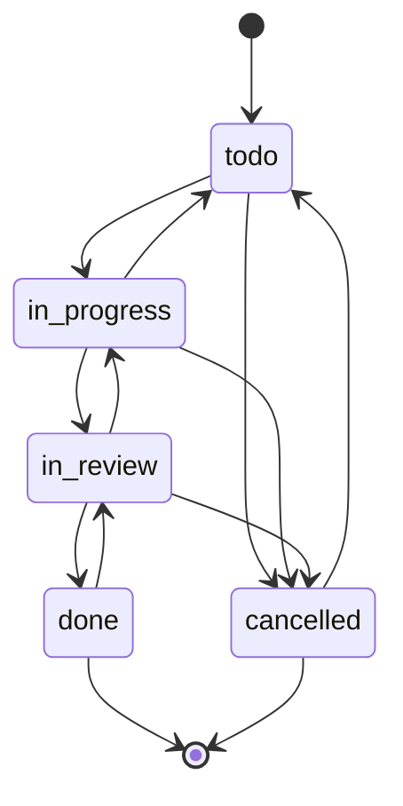

# Task API Documentation

## Overview

The Task API provides comprehensive endpoints for managing project tasks, the fundamental unit of work in Ardha. Tasks support flexible workflows, dependencies, time tracking, AI integration, and rich metadata including OpenSpec proposals and Git commits.

## Base URL

```
/api/v1/tasks
```

## Authentication

All Task API endpoints require authentication via JWT token. Include the token in the Authorization header:

```
Authorization: Bearer <your-jwt-token>
```

## Core Concepts

### Task Structure

Each task contains:
- **Identity**: Unique ID and project-specific identifier (e.g., ARD-001)
- **Content**: Title, description, and organizational hierarchy
- **Status**: Workflow state with validated transitions
- **Assignment**: Creator and assignee information
- **Estimation**: Time estimates and complexity levels
- **Priority**: Urgency levels for task management
- **Relationships**: Dependencies, tags, and milestones
- **Integration**: OpenSpec proposals and Git commits
- **Metadata**: AI generation info and activity logs

### Task Statuses

- `todo`: Initial state, work not started
- `in_progress`: Active work in progress
- `in_review`: Work completed, awaiting review
- `done`: Task completed and approved
- `cancelled`: Task cancelled, no longer active

### Priority Levels

- `urgent`: Highest priority, immediate attention needed
- `high`: Important, should be done soon
- `medium`: Normal priority (default)
- `low`: Lower priority, can be deferred

### Complexity Levels

- `trivial`: Very simple, quick to implement
- `simple`: Straightforward implementation
- `medium`: Moderate complexity
- `complex`: Requires significant effort
- `very_complex`: Highly complex, may need research

### Task Identifiers

Each task has a unique project identifier in format `PROJECT-###`:
- Auto-generated on creation
- Sequential within project
- Human-readable for references
- Used in commit messages and communications

## Endpoints

### 1. Create Task

**POST** `/projects/{project_id}/tasks`

Creates a new task with optional tags and dependencies.

#### Request

```json
{
  "title": "Implement user authentication API",
  "description": "Create JWT-based authentication endpoints for login, register, and refresh tokens",
  "status": "todo",
  "assignee_id": "123e4567-e89b-12d3-a456-426614174000",
  "phase": "Phase 1: Backend Development",
  "milestone_id": "123e4567-e89b-12d3-a456-426614174001",
  "epic": "User Management",
  "estimate_hours": 8.0,
  "complexity": "medium",
  "priority": "high",
  "due_date": "2025-11-20T00:00:00Z",
  "tags": ["backend", "authentication", "api"],
  "depends_on": ["123e4567-e89b-12d3-a456-426614174002"],
  "openspec_change_path": "openspec/changes/user-auth/",
  "ai_generated": false,
  "ai_confidence": 0.85,
  "ai_reasoning": "Critical for user onboarding flow"
}
```

#### Path Parameters

- `project_id` (UUID): Project ID to create task in

#### Request Fields

**Required:**
- `title` (string, 1-500 chars): Task title

**Optional:**
- `description` (string): Detailed description
- `status` (string, default: "todo"): Initial status
- `assignee_id` (UUID): User to assign task to
- `phase` (string, max 100 chars): Development phase
- `milestone_id` (UUID): Associated milestone
- `epic` (string, max 255 chars): Epic/theme for grouping
- `estimate_hours` (float, ≥0): Time estimate
- `complexity` (string): Complexity level
- `priority` (string, default: "medium"): Priority level
- `due_date` (datetime): Target completion date
- `tags` (string array): Tag names to apply
- `depends_on` (UUID array): Task IDs this task depends on
- `openspec_change_path` (string): OpenSpec directory path
- `ai_generated` (boolean, default: false): AI creation flag
- `ai_confidence` (float, 0.0-1.0): AI confidence score
- `ai_reasoning` (string): AI reasoning explanation

#### Response

```json
{
  "id": "123e4567-e89b-12d3-a456-426614174003",
  "project_id": "123e4567-e89b-12d3-a456-426614174001",
  "identifier": "ARD-001",
  "title": "Implement user authentication API",
  "description": "Create JWT-based authentication endpoints for login, register, and refresh tokens",
  "status": "todo",
  "assignee_id": "123e4567-e89b-12d3-a456-426614174000",
  "assignee_username": "johndoe",
  "assignee_full_name": "John Doe",
  "created_by_id": "123e4567-e89b-12d3-a456-426614174001",
  "created_by_username": "admin",
  "created_by_full_name": "Admin User",
  "phase": "Phase 1: Backend Development",
  "milestone_id": "123e4567-e89b-12d3-a456-426614174001",
  "epic": "User Management",
  "estimate_hours": 8.0,
  "actual_hours": null,
  "complexity": "medium",
  "priority": "high",
  "openspec_change_path": "openspec/changes/user-auth/",
  "ai_generated": false,
  "ai_confidence": 0.85,
  "related_commits": [],
  "related_prs": [],
  "related_files": [],
  "due_date": "2025-11-20T00:00:00Z",
  "started_at": null,
  "completed_at": null,
  "created_at": "2025-11-15T10:00:00Z",
  "updated_at": "2025-11-15T10:00:00Z",
  "tags": [
    {
      "id": "tag-uuid-1",
      "name": "backend",
      "color": "#3b82f6"
    }
  ],
  "dependencies": [
    {
      "id": "dep-uuid-1",
      "task_id": "123e4567-e89b-12d3-a456-426614174003",
      "depends_on_task_id": "123e4567-e89b-12d3-a456-426614174002",
      "depends_on_task_identifier": "ARD-000",
      "depends_on_task_title": "Setup project structure",
      "depends_on_task_status": "done"
    }
  ],
  "blocking": [],
  "is_blocked": false
}
```

#### Error Responses

- `400`: Validation error or circular dependency
- `403`: Forbidden (insufficient permissions)
- `404`: Project not found
- `422`: Unprocessable entity (validation errors)

---

### 2. List Project Tasks

**GET** `/projects/{project_id}/tasks`

Retrieves filtered and paginated list of tasks for a project.

#### Query Parameters

**Filters:**
- `status` (string array): Filter by status values
- `assignee_id` (UUID): Filter by assignee
- `priority` (string array): Filter by priority values
- `milestone_id` (UUID): Filter by milestone
- `has_due_date` (boolean): Tasks with/without due dates
- `overdue_only` (boolean, default: false): Only overdue tasks
- `tags` (string array): Filter by tag names
- `search` (string): Search in title/description/identifier

**Sorting:**
- `sort_by` (string, default: "created_at"): Sort field
  - Values: `created_at`, `due_date`, `priority`, `status`, `updated_at`
- `sort_order` (string, default: "desc"): Sort direction
  - Values: `asc`, `desc`

**Pagination:**
- `skip` (integer, default: 0): Pagination offset
- `limit` (integer, default: 100, max: 100): Page size

#### Response

```json
{
  "tasks": [
    {
      "id": "123e4567-e89b-12d3-a456-426614174003",
      "identifier": "ARD-001",
      "title": "Implement user authentication API",
      "status": "todo",
      "priority": "high",
      "assignee_username": "johndoe",
      "due_date": "2025-11-20T00:00:00Z",
      "is_blocked": false,
      "created_at": "2025-11-15T10:00:00Z"
    }
  ],
  "total": 1,
  "skip": 0,
  "limit": 100,
  "status_counts": {
    "todo": 5,
    "in_progress": 3,
    "in_review": 2,
    "done": 8,
    "cancelled": 0
  }
}
```

#### Error Responses

- `403`: Forbidden (insufficient permissions)
- `404`: Project not found

---

### 3. Get Task by ID

**GET** `/{task_id}`

Retrieves detailed task information by UUID.

#### Path Parameters

- `task_id` (UUID): Task ID

#### Response

Same as Create Task response with all fields populated.

#### Error Responses

- `403`: Forbidden (insufficient permissions)
- `404`: Task not found

---

### 4. Get Task by Identifier

**GET** `/identifier/{project_id}/{identifier}`

Retrieves task by project-specific identifier.

#### Path Parameters

- `project_id` (UUID): Project ID
- `identifier` (string): Task identifier (e.g., "ARD-001")

#### Response

Same as Get Task by ID response.

#### Error Responses

- `403`: Forbidden (insufficient permissions)
- `404`: Task not found

---

### 5. Update Task

**PATCH** `/{task_id}`

Updates task fields with activity logging. All fields are optional for partial updates.

#### Request

```json
{
  "title": "Updated: Implement user authentication API",
  "description": "Updated description with more details",
  "status": "in_progress",
  "assignee_id": "123e4567-e89b-12d3-a456-426614174004",
  "estimate_hours": 10.0,
  "actual_hours": 2.5,
  "priority": "urgent",
  "due_date": "2025-11-22T00:00:00Z"
}
```

#### Path Parameters

- `task_id` (UUID): Task ID

#### Request Fields (All Optional)

Same fields as Create Task, but all optional for partial updates.

#### Response

Updated task object with new values.

#### Error Responses

- `400`: Validation error
- `403`: Forbidden (insufficient permissions)
- `404`: Task not found

---

### 6. Delete Task

**DELETE** `/{task_id}`

Deletes a task permanently. Requires admin permissions.

#### Path Parameters

- `task_id` (UUID): Task ID

#### Response

```json
{
  "message": "Task deleted successfully"
}
```

#### Error Responses

- `403`: Forbidden (insufficient permissions)
- `404`: Task not found

---

### 7. Update Task Status

**PATCH** `/{task_id}/status`

Updates task status with transition validation and automatic timestamp management.

#### Request

```json
{
  "status": "in_progress"
}
```

#### Path Parameters

- `task_id` (UUID): Task ID

#### Request Fields

- `status` (string, required): New status
  - Values: `todo`, `in_progress`, `in_review`, `done`, `cancelled`

#### Valid Status Transitions



#### Automatic Timestamps

- `todo` → `in_progress`: Sets `started_at`
- `*` → `done`: Sets `completed_at`
- `done` → `in_review`: Clears `completed_at`

#### Response

Updated task with new status and timestamps.

#### Error Responses

- `400`: Invalid status transition
- `403`: Forbidden (insufficient permissions)
- `404`: Task not found

---

### 8. Assign Task

**POST** `/{task_id}/assign`

Assigns task to a user.

#### Request

```json
{
  "assignee_id": "123e4567-e89b-12d3-a456-426614174004"
}
```

#### Path Parameters

- `task_id` (UUID): Task ID

#### Request Fields

- `assignee_id` (UUID, required): User to assign task to

#### Response

Updated task with new assignee.

#### Error Responses

- `403`: Forbidden (insufficient permissions)
- `404`: Task not found
- `400`: Assignee not project member

---

### 9. Unassign Task

**POST** `/{task_id}/unassign`

Removes assignee from task.

#### Path Parameters

- `task_id` (UUID): Task ID

#### Response

Updated task with assignee cleared.

#### Error Responses

- `403`: Forbidden (insufficient permissions)
- `404`: Task not found

---

### 10. Add Task Dependency

**POST** `/{task_id}/dependencies`

Adds dependency between tasks with circular dependency detection.

#### Request

```json
{
  "depends_on_task_id": "123e4567-e89b-12d3-a456-426614174002"
}
```

#### Path Parameters

- `task_id` (UUID): Task that will depend on another

#### Request Fields

- `depends_on_task_id` (UUID, required): Task to depend on

#### Circular Dependency Detection

- Prevents A → B → A cycles
- Uses BFS graph traversal
- Returns `400 Bad Request` if cycle detected

#### Response

```json
{
  "id": "dep-uuid-1",
  "task_id": "123e4567-e89b-12d3-a456-426614174003",
  "depends_on_task_id": "123e4567-e89b-12d3-a456-426614174002",
  "depends_on_task_identifier": "ARD-000",
  "depends_on_task_title": "Setup project structure",
  "depends_on_task_status": "done"
}
```

#### Error Responses

- `400`: Circular dependency or same task
- `403`: Forbidden (insufficient permissions)
- `404`: Task not found
- `400`: Tasks in different projects

---

### 11. Remove Task Dependency

**DELETE** `/{task_id}/dependencies/{depends_on_task_id}`

Removes dependency between tasks.

#### Path Parameters

- `task_id` (UUID): Task with dependency
- `depends_on_task_id` (UUID): Dependency to remove

#### Response

```json
{
  "message": "Dependency removed successfully"
}
```

#### Error Responses

- `403`: Forbidden (insufficient permissions)
- `404`: Task or dependency not found

---

### 12. List Task Dependencies

**GET** `/{task_id}/dependencies`

Retrieves all dependencies for a task.

#### Path Parameters

- `task_id` (UUID): Task ID

#### Response

Array of dependency objects with related task information.

```json
[
  {
    "id": "dep-uuid-1",
    "task_id": "123e4567-e89b-12d3-a456-426614174003",
    "depends_on_task_id": "123e4567-e89b-12d3-a456-426614174002",
    "depends_on_task_identifier": "ARD-000",
    "depends_on_task_title": "Setup project structure",
    "depends_on_task_status": "done"
  }
]
```

#### Error Responses

- `403`: Forbidden (insufficient permissions)
- `404`: Task not found

---

### 13. Add Tag to Task

**POST** `/{task_id}/tags`

Adds or creates a tag and applies it to task.

#### Request

```json
{
  "name": "backend",
  "color": "#3b82f6"
}
```

#### Path Parameters

- `task_id` (UUID): Task ID

#### Request Fields

- `name` (string, 1-50 chars, required): Tag name
- `color` (string, default: "#6366f1"): Hex color code

#### Response

Updated task with new tag included.

#### Error Responses

- `403`: Forbidden (insufficient permissions)
- `404`: Task not found

---

### 14. Remove Tag from Task

**DELETE** `/{task_id}/tags/{tag_id}`

Removes tag from task.

#### Path Parameters

- `task_id` (UUID): Task ID
- `tag_id` (UUID): Tag ID to remove

#### Response

Updated task with tag removed.

#### Error Responses

- `403`: Forbidden (insufficient permissions)
- `404`: Task not found

---

### 15. Get Task Activity Log

**GET** `/{task_id}/activities`

Retrieves comprehensive activity history for a task.

#### Query Parameters

- `limit` (integer, default: 50, max: 100): Number of activities to return

#### Path Parameters

- `task_id` (UUID): Task ID

#### Response

Array of activity entries with user information.

```json
[
  {
    "id": "activity-uuid-1",
    "action": "status_changed",
    "old_value": "todo",
    "new_value": "in_progress",
    "comment": null,
    "created_at": "2025-11-15T11:00:00Z",
    "user_id": "123e4567-e89b-12d3-a456-426614174000",
    "user_username": "johndoe",
    "user_full_name": "John Doe"
  },
  {
    "id": "activity-uuid-2",
    "action": "assigned",
    "old_value": null,
    "new_value": "123e4567-e89b-12d3-a456-426614174000",
    "comment": null,
    "created_at": "2025-11-15T10:30:00Z",
    "user_id": "123e4567-e89b-12d3-a456-426614174001",
    "user_username": "admin",
    "user_full_name": "Admin User"
  }
]
```

#### Activity Types

- `created`: Task created
- `status_changed`: Status updated
- `assigned`: Task assigned to user
- `unassigned`: Task unassigned
- `dependency_added`: Dependency added
- `dependency_removed`: Dependency removed
- `tag_added`: Tag added to task
- `tag_removed`: Tag removed from task
- `git_commit_linked`: Git commit linked
- `openspec_linked`: OpenSpec proposal linked

#### Error Responses

- `403`: Forbidden (insufficient permissions)
- `404`: Task not found

---

### 16. Get Board View

**GET** `/projects/{project_id}/tasks/board`

Retrieves tasks grouped by status for Kanban board view.

#### Path Parameters

- `project_id` (UUID): Project ID

#### Response

Tasks grouped by status with counts.

```json
{
  "todo": [
    {
      "id": "task-uuid-1",
      "identifier": "ARD-002",
      "title": "Setup database schema",
      "status": "todo",
      "priority": "high",
      "assignee_username": null,
      "is_blocked": false
    }
  ],
  "in_progress": [
    {
      "id": "task-uuid-2",
      "identifier": "ARD-001",
      "title": "Implement user authentication API",
      "status": "in_progress",
      "priority": "high",
      "assignee_username": "johndoe",
      "is_blocked": false
    }
  ],
  "in_review": [],
  "done": [
    {
      "id": "task-uuid-3",
      "identifier": "ARD-000",
      "title": "Setup project structure",
      "status": "done",
      "priority": "medium",
      "assignee_username": "admin",
      "is_blocked": false
    }
  ],
  "cancelled": [],
  "total": 3,
  "counts": {
    "todo": 1,
    "in_progress": 1,
    "in_review": 0,
    "done": 1,
    "cancelled": 0
  }
}
```

#### Error Responses

- `403`: Forbidden (insufficient permissions)
- `404`: Project not found

---

### 17. Get Calendar View

**GET** `/projects/{project_id}/tasks/calendar`

Retrieves tasks grouped by due date for calendar view.

#### Query Parameters

- `start_date` (datetime, optional): Start of date range (default: 30 days ago)
- `end_date` (datetime, optional): End of date range (default: 90 days ahead)

#### Path Parameters

- `project_id` (UUID): Project ID

#### Response

Tasks grouped by ISO date string.

```json
{
  "tasks_by_date": {
    "2025-11-20": [
      {
        "id": "task-uuid-1",
        "identifier": "ARD-001",
        "title": "Implement user authentication API",
        "status": "in_progress",
        "priority": "high",
        "due_date": "2025-11-20T00:00:00Z",
        "is_blocked": false
      }
    ],
    "2025-11-25": [
      {
        "id": "task-uuid-2",
        "identifier": "ARD-002",
        "title": "Setup database schema",
        "status": "todo",
        "priority": "high",
        "due_date": "2025-11-25T00:00:00Z",
        "is_blocked": true
      }
    ]
  },
  "total": 2,
  "date_range_start": "2025-10-16T00:00:00Z",
  "date_range_end": "2026-02-13T00:00:00Z"
}
```

#### Error Responses

- `403`: Forbidden (insufficient permissions)
- `404`: Project not found

---

### 18. Get Timeline View

**GET** `/projects/{project_id}/tasks/timeline`

Retrieves tasks for timeline/Gantt chart view with dependencies.

#### Path Parameters

- `project_id` (UUID): Project ID

#### Response

Tasks with date ranges and dependencies for timeline visualization.

```json
{
  "tasks": [
    {
      "id": "task-uuid-1",
      "identifier": "ARD-000",
      "title": "Setup project structure",
      "status": "done",
      "created_at": "2025-11-10T00:00:00Z",
      "completed_at": "2025-11-12T00:00:00Z",
      "dependencies": [],
      "is_blocked": false
    },
    {
      "id": "task-uuid-2",
      "identifier": "ARD-001",
      "title": "Implement user authentication API",
      "status": "in_progress",
      "created_at": "2025-11-15T00:00:00Z",
      "due_date": "2025-11-20T00:00:00Z",
      "dependencies": [
        {
          "depends_on_task_id": "task-uuid-1",
          "depends_on_task_identifier": "ARD-000"
        }
      ],
      "is_blocked": false
    }
  ],
  "total": 2,
  "earliest_date": "2025-11-10T00:00:00Z",
  "latest_date": "2025-11-20T00:00:00Z"
}
```

#### Error Responses

- `403`: Forbidden (insufficient permissions)
- `404`: Project not found

## Computed Properties

### is_blocked

Boolean indicating if task is blocked by incomplete dependencies.

**Logic:**
- Returns `true` if any dependency task has status ≠ `done`
- Returns `false` if no dependencies or all dependencies complete
- Computed on-demand for performance

### Task Identifiers

Auto-generated project-specific identifiers:
- Format: `{PROJECT_CODE}-{###}`
- Sequential numbering within project
- Human-readable for references
- Used in commit messages and communications

## Dependencies System

### Circular Dependency Detection

- **Algorithm**: Breadth-First Search (BFS) graph traversal
- **Detection**: Prevents A → B → A cycles
- **Validation**: Checked before adding any dependency
- **Error**: Returns `400 Bad Request` with descriptive message

### Dependency Types

- **Blocking**: Tasks that depend on this task
- **Dependencies**: Tasks this task depends on
- **Visualization**: Available in timeline view

### Dependency Rules

1. Tasks must be in same project
2. Cannot create circular dependencies
3. Dependencies affect `is_blocked` status
4. No limit on number of dependencies

## Tag System

### Tag Structure

- **Name**: Unique within project (case-insensitive)
- **Color**: Hex color code for UI visualization
- **Creation**: Auto-created if doesn't exist
- **Management**: Add/remove via dedicated endpoints

### Tag Validation

- Name: 1-50 characters, trimmed, lowercase
- Color: Hex format `#RRGGBB`
- Uniqueness: Enforced within project

### Common Tag Patterns

- **Technology**: `backend`, `frontend`, `database`, `api`
- **Type**: `bug`, `feature`, `enhancement`, `refactor`
- **Priority**: `urgent`, `security`, `performance`
- **Component**: `auth`, `ui`, `testing`, `documentation`

## Activity Logging

### Automatic Logging

All task mutations automatically log activities:
- Field changes with old/new values
- Status transitions
- Assignment changes
- Dependency modifications
- Tag additions/removals

### Activity Structure

- **Action**: Type of change performed
- **Values**: Old and new values for comparison
- **User**: Who performed the action
- **Timestamp**: When the action occurred
- **Comment**: Optional additional context

### Activity Types

- `created`: Task creation
- `status_changed`: Status updates
- `assigned`: Task assignment
- `unassigned`: Task unassignment
- `dependency_added`: Dependency creation
- `dependency_removed`: Dependency removal
- `tag_added`: Tag addition
- `tag_removed`: Tag removal
- `git_commit_linked`: Git commit linking
- `openspec_linked`: OpenSpec proposal linking

## Status Transition Rules

### Valid Transitions

| From | To | Description |
|------|----|-------------|
| `todo` | `in_progress` | Start work |
| `todo` | `cancelled` | Cancel before starting |
| `in_progress` | `in_review` | Submit for review |
| `in_progress` | `todo` | Pause work |
| `in_progress` | `cancelled` | Cancel during work |
| `in_review` | `done` | Approve and complete |
| `in_review` | `in_progress` | Request changes |
| `in_review` | `cancelled` | Cancel during review |
| `done` | `in_review` | Reopen for changes |
| `cancelled` | `todo` | Uncancel and restart |

### Transition Validation

- All transitions must follow valid paths
- Invalid transitions return `400 Bad Request`
- Automatic timestamp management:
  - `todo` → `in_progress`: Sets `started_at`
  - `*` → `done`: Sets `completed_at`
  - `done` → `in_review`: Clears `completed_at`

## Time Tracking

### Estimation Fields

- `estimate_hours`: Planned effort (float, ≥0)
- `actual_hours`: Tracked time spent (float, ≥0)
- `complexity`: Subjective complexity level

### Time Calculations

- No automatic time tracking
- Manual updates via task updates
- Can be integrated with external time tracking tools

### Complexity Levels

- `trivial`: < 2 hours
- `simple`: 2-4 hours
- `medium`: 4-8 hours
- `complex`: 8-16 hours
- `very_complex`: > 16 hours

## Priority System

### Priority Levels

- `urgent`: Immediate attention, blocks other work
- `high`: Important, should be done soon
- `medium`: Normal priority (default)
- `low`: Can be deferred, nice to have

### Priority Usage

- Sorting in task lists
- Filtering in views
- Visual indicators in UI
- Reporting and analytics

## OpenSpec Integration

### OpenSpec Fields

- `openspec_change_path`: Path to OpenSpec change directory
- `openspec_proposal_id`: Linked proposal UUID
- Auto-syncing from OpenSpec task definitions

### Integration Features

- Link tasks to OpenSpec proposals
- Sync task status from OpenSpec
- Track AI-generated task metadata
- Maintain traceability from spec to implementation

### OpenSpec Workflow

1. Create OpenSpec proposal with tasks
2. Generate tasks from proposal
3. Link tasks back to proposal
4. Sync status updates
5. Archive when complete

## Git Integration

### Git Fields

- `related_commits`: Array of commit SHAs
- `related_prs`: Array of pull request URLs
- `related_files`: Array of modified file paths

### Integration Features

- Link commits to tasks automatically
- Track pull requests associated with tasks
- Monitor file changes per task
- Auto-update status on commit (optional)

### Git Workflow

1. Developer works on task
2. Commits include task identifier in message
3. System auto-links commits to task
4. Optional status update to `in_progress`
5. PR linking for code review

## AI Integration

### AI Fields

- `ai_generated`: Boolean flag for AI-created tasks
- `ai_confidence`: Float score (0.0-1.0) of AI confidence
- `ai_reasoning`: Text explanation of AI's reasoning

### AI Features

- AI task generation from requirements
- Confidence scoring for quality assessment
- Reasoning explanations for transparency
- Integration with AI workflow systems

### AI Workflow

1. AI analyzes requirements
2. Generates tasks with metadata
3. Assigns confidence scores
4. Provides reasoning explanations
5. Human reviews and approves

## Permissions

### Project Roles

- **viewer**: Can view tasks
- **member**: Can create, update, assign tasks
- **admin**: Can delete tasks, manage all aspects

### Operation Permissions

| Operation | Required Role |
|-----------|---------------|
| View tasks | viewer |
| Create task | member |
| Update task | member |
| Update status | member |
| Assign task | member |
| Add dependencies | member |
| Add tags | member |
| Delete task | admin |

### Cross-Project Rules

- Tasks belong to exactly one project
- Dependencies only within same project
- Tags scoped to project level
- Permissions inherited from project membership

## Filtering and Search

### Filter Combinations

Multiple filters can be combined with AND logic:
- Status + assignee + priority
- Tags + due date + search
- Milestone + complexity + overdue

### Search Functionality

Searches across:
- Task titles (primary)
- Descriptions
- Task identifiers
- Case-insensitive partial matching

### Sorting Options

- `created_at`: Task creation time
- `due_date`: Target completion date
- `priority`: Priority level (urgent → low)
- `status`: Status order (todo → done)
- `updated_at`: Last modification time

## Special Views

### Board View (Kanban)

- Groups tasks by status columns
- Includes task counts per column
- Optimized for drag-drop operations
- Real-time status updates

### Calendar View

- Groups tasks by due date
- Date range filtering
- Visual calendar integration
- Overdue task highlighting

### Timeline View (Gantt)

- Shows tasks with date ranges
- Includes dependency visualization
- Project timeline planning
- Critical path analysis

## Error Handling

### Common Error Formats

```json
{
  "detail": "Error message describing the issue"
}
```

### Validation Errors

- Invalid status transitions
- Circular dependencies
- Invalid enum values
- Field length/format violations

### Permission Errors

- User not in project
- Insufficient role for operation
- Cross-project access attempts

### Business Logic Errors

- Task not found
- Dependency conflicts
- Tag creation failures
- Assignment validation errors

## Rate Limiting

- Standard API rate limits apply
- Bulk operations should be spaced out
- Activity logging has no limits
- Search operations may be throttled

## Monitoring

### Key Metrics

- Task creation and completion rates
- Status transition patterns
- Dependency complexity
- Assignment efficiency
- AI generation usage

### Logging Levels

- `INFO`: Task lifecycle events
- `WARN`: Permission issues, validation warnings
- `ERROR`: Database errors, business rule violations
- `DEBUG`: Detailed operation information

## Best Practices

### Task Creation

1. Use descriptive, actionable titles
2. Include detailed descriptions with acceptance criteria
3. Set realistic time estimates
4. Assign appropriate priority and complexity
5. Link to relevant milestones and epics

### Status Management

1. Follow valid transition rules
2. Update status promptly as work progresses
3. Use `in_review` for code review phases
4. Complete tasks only when truly done
5. Cancel tasks that are no longer needed

### Dependencies

1. Keep dependencies minimal and clear
2. Avoid deep dependency chains
3. Use milestones for high-level grouping
4. Review dependencies regularly
5. Document dependency reasons in descriptions

### Tags and Organization

1. Use consistent tag naming conventions
2. Limit tags to essential categories
3. Use colors for visual organization
4. Review and clean up unused tags
5. Align tags with project taxonomy

### Time Tracking

1. Update estimates as requirements change
2. Track actual time for future planning
3. Use complexity levels for effort estimation
4. Review estimation accuracy regularly
5. Adjust based on team velocity

## Integration Examples

### Creating a Task with Dependencies

```python
# Create main task
main_task = requests.post(
    f"{API_BASE}/projects/{project_id}/tasks",
    json={
        "title": "Implement user authentication",
        "priority": "high",
        "estimate_hours": 8.0,
        "tags": ["backend", "security"]
    },
    headers={"Authorization": f"Bearer {token}"}
).json()

# Create prerequisite task
prereq_task = requests.post(
    f"{API_BASE}/projects/{project_id}/tasks",
    json={
        "title": "Setup database schema",
        "priority": "high",
        "estimate_hours": 4.0
    },
    headers={"Authorization": f"Bearer {token}"}
).json()

# Add dependency
requests.post(
    f"{API_BASE}/tasks/{main_task['id']}/dependencies",
    json={
        "depends_on_task_id": prereq_task['id']
    },
    headers={"Authorization": f"Bearer {token}"}
)
```

### Board View Implementation

```python
# Get board view for project
response = requests.get(
    f"{API_BASE}/projects/{project_id}/tasks/board",
    headers={"Authorization": f"Bearer {token}"}
)

board = response.json()
for status, tasks in board.items():
    if status != 'total' and status != 'counts':
        print(f"{status.upper()}: {len(tasks)} tasks")
        for task in tasks:
            print(f"  - {task['identifier']}: {task['title']}")
```

### Activity Monitoring

```python
# Get recent activity for a task
response = requests.get(
    f"{API_BASE}/tasks/{task_id}/activities",
    params={"limit": 20},
    headers={"Authorization": f"Bearer {token}"}
)

activities = response.json()
for activity in activities:
    user = activity['user_username'] or 'System'
    print(f"{user} {activity['action']} at {activity['created_at']}")
    if activity['old_value'] and activity['new_value']:
        print(f"  {activity['old_value']} → {activity['new_value']}")
```

### Advanced Filtering

```python
# Get high-priority backend tasks assigned to user
response = requests.get(
    f"{API_BASE}/projects/{project_id}/tasks",
    params={
        "status": ["todo", "in_progress"],
        "priority": ["urgent", "high"],
        "tags": ["backend"],
        "assignee_id": user_id,
        "sort_by": "priority",
        "sort_order": "desc"
    },
    headers={"Authorization": f"Bearer {token}"}
)

tasks = response.json()['tasks']
for task in tasks:
    print(f"{task['identifier']}: {task['title']} ({task['priority']})")
```

## Version History

- **v1.0**: Initial task API with CRUD operations
- **v1.1**: Added dependency management and circular detection
- **v1.2**: Enhanced status transitions and activity logging
- **v1.3**: Added board, calendar, and timeline views
- **v1.4**: Integrated OpenSpec and Git linking
- **v1.5**: Added AI metadata and confidence scoring

## Support

For issues with the Task API:
1. Check the error messages for specific issues
2. Verify project permissions and membership
3. Review status transition rules
4. Check for circular dependencies
5. Contact the development team for persistent issues
