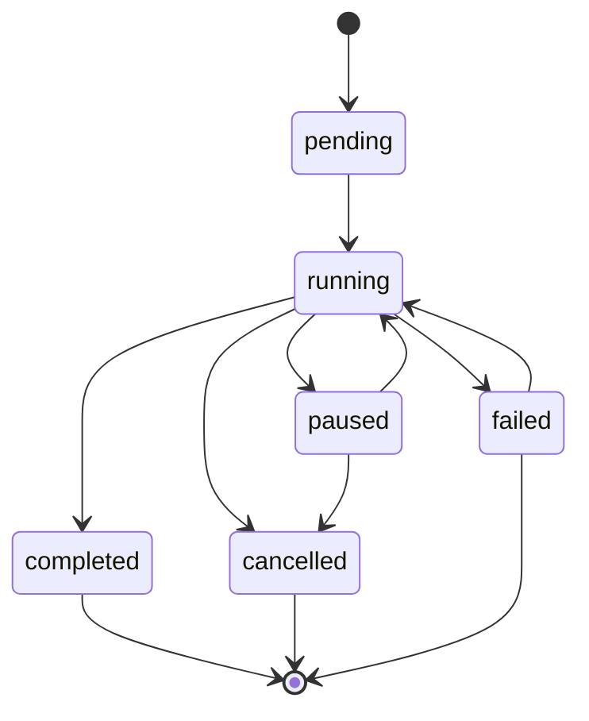

# Workflow API Documentation

## Overview

The Workflow API provides endpoints for executing and managing AI-powered workflows using LangGraph orchestration. Workflows automate complex multi-step processes like research, architecture design, implementation, and debugging, with state persistence, real-time progress tracking, and cost monitoring.

## Base URL

```
/api/v1/workflows
```

## Authentication

All Workflow API endpoints require authentication via JWT token. Include the token in the Authorization header:

```
Authorization: Bearer <your-jwt-token>
```

## Core Concepts

### Workflow System Architecture

The workflow system is built on LangGraph StateGraph with:
- **State Management**: Persistent state tracking with Redis checkpoints
- **Node Execution**: Specialized AI nodes for different tasks
- **Memory Integration**: Qdrant vector database for context
- **Cost Tracking**: Real-time token usage and cost monitoring
- **Error Handling**: Retry logic and graceful failure recovery

### Workflow Types

- `research`: Market research, competitive analysis, feasibility studies
- `architect`: System design, architecture decisions, technical specifications
- `implement`: Code generation, feature implementation, development tasks
- `debug`: Error analysis, troubleshooting, performance optimization
- `full_development`: Complete development lifecycle from idea to deployment
- `custom`: User-defined workflow configurations

### Execution States



### Node Types

Each workflow consists of specialized nodes:
- **Research Nodes**: Market analysis, competitive research, technical feasibility
- **Architect Nodes**: System design, API specification, database design
- **Implementation Nodes**: Code generation, testing, documentation
- **Debug Nodes**: Error analysis, performance profiling, optimization
- **Memory Nodes**: Context management, knowledge retrieval

## Endpoints

### 1. Execute Workflow

**POST** `/execute`

Executes a new workflow instance with specified parameters and context.

#### Request

```json
{
  "workflow_type": "research",
  "initial_request": "Research the market for AI-powered project management tools and analyze competitive landscape",
  "project_id": "123e4567-e89b-12d3-a456-426614174000",
  "parameters": {
    "max_retries": 3,
    "timeout": 300,
    "temperature": 0.7,
    "max_tokens": 4000
  },
  "context": {
    "target_market": "SME software teams",
    "geographic_focus": "North America and Europe",
    "competitors": ["Linear", "Jira", "Notion", "Asana"],
    "research_depth": "comprehensive"
  }
}
```

#### Request Fields

**Required:**
- `workflow_type` (string): Type of workflow to execute
  - Values: `research`, `architect`, `implement`, `debug`, `full_development`, `custom`
- `initial_request` (string, 1-10000 chars): User prompt or request

**Optional:**
- `project_id` (UUID): Associated project for context
- `parameters` (object): Workflow execution parameters
  - `max_retries` (integer, default: 3): Maximum retry attempts
  - `timeout` (integer, default: 300): Node timeout in seconds
  - `temperature` (float, 0.0-1.0): AI model temperature
  - `max_tokens` (integer): Maximum tokens per AI call
- `context` (object): Additional context data
  - Custom key-value pairs for workflow execution
  - Project-specific information
  - User preferences and constraints

#### Response

```json
{
  "id": "123e4567-e89b-12d3-a456-426614174001",
  "workflow_id": "123e4567-e89b-12d3-a456-426614174001",
  "user_id": "123e4567-e89b-12d3-a456-426614174000",
  "project_id": "123e4567-e89b-12d3-a456-426614174000",
  "initial_request": "Research the market for AI-powered project management tools...",
  "context": {
    "target_market": "SME software teams",
    "geographic_focus": "North America and Europe"
  },
  "parameters": {
    "max_retries": 3,
    "timeout": 300,
    "temperature": 0.7
  },
  "status": "running",
  "current_node": "market_research",
  "completed_nodes": [],
  "failed_nodes": [],
  "results": {},
  "artifacts": {},
  "metadata": {
    "workflow_type": "research",
    "node_count": 5,
    "estimated_duration": 1800
  },
  "ai_calls": [],
  "token_usage": {"total": 0},
  "total_cost": 0.0,
  "errors": [],
  "retry_count": 0,
  "created_at": "2025-11-15T10:00:00Z",
  "started_at": "2025-11-15T10:00:01Z",
  "completed_at": null,
  "last_activity": "2025-11-15T10:00:01Z"
}
```

#### Error Responses

- `400`: Invalid workflow type or parameters
- `402`: Insufficient AI budget
- `403`: Forbidden (insufficient permissions)
- `500`: Internal server error

---

### 2. Get Execution Status

**GET** `/executions/{execution_id}`

Retrieves current status and progress of a workflow execution.

#### Path Parameters

- `execution_id` (UUID): Workflow execution ID

#### Response

```json
{
  "execution_id": "123e4567-e89b-12d3-a456-426614174001",
  "workflow_id": "123e4567-e89b-12d3-a456-426614174001",
  "status": "running",
  "current_node": "competitive_analysis",
  "completed_nodes": ["market_research"],
  "failed_nodes": [],
  "progress": 40.0,
  "results": {
    "market_research": {
      "market_size": "$2.5B",
      "growth_rate": "15% CAGR",
      "key_segments": ["SME", "Enterprise", "Startup"]
    }
  },
  "artifacts": {
    "market_research_report": {
      "content": "Comprehensive market analysis...",
      "format": "markdown",
      "size": 15420
    }
  },
  "errors": [],
  "total_cost": 2.45,
  "token_usage": {
    "total": 12500,
    "by_model": {
      "anthropic/claude-sonnet-4.5": {"input": 8000, "output": 4500}
    }
  },
  "last_activity": "2025-11-15T10:05:30Z"
}
```

#### Error Responses

- `403`: Forbidden (not your execution)
- `404`: Execution not found

---

### 3. Cancel Workflow Execution

**POST** `/executions/{execution_id}/cancel`

Cancels a running workflow execution with optional reason.

#### Request

```json
{
  "reason": "User requested cancellation - requirements changed"
}
```

#### Path Parameters

- `execution_id` (UUID): Workflow execution ID

#### Request Fields (Optional)

- `reason` (string): Cancellation reason for logging

#### Response

```json
{
  "message": "Execution cancelled successfully",
  "execution_id": "123e4567-e89b-12d3-a456-426614174001",
  "reason": "User requested cancellation - requirements changed",
  "cancelled_at": "2025-11-15T10:08:15Z"
}
```

#### Error Responses

- `400`: Cannot cancel execution (already completed/failed)
- `403`: Forbidden (not your execution)
- `404`: Execution not found

---

### 4. List User Executions

**GET** `/executions`

Retrieves paginated list of workflow executions for the current user.

#### Query Parameters

**Filters:**
- `status` (string): Filter by execution status
  - Values: `pending`, `running`, `completed`, `failed`, `cancelled`, `paused`
- `workflow_type` (string): Filter by workflow type
- `project_id` (UUID): Filter by project ID

**Pagination:**
- `limit` (integer, default: 50, max: 100): Page size
- `offset` (integer, default: 0): Pagination offset

#### Response

```json
{
  "executions": [
    {
      "id": "123e4567-e89b-12d3-a456-426614174001",
      "workflow_id": "123e4567-e89b-12d3-a456-426614174001",
      "user_id": "123e4567-e89b-12d3-a456-426614174000",
      "project_id": "123e4567-e89b-12d3-a456-426614174000",
      "initial_request": "Research AI project management tools...",
      "status": "completed",
      "total_cost": 12.50,
      "token_usage": {"total": 45000},
      "created_at": "2025-11-15T09:00:00Z",
      "completed_at": "2025-11-15T09:15:30Z"
    }
  ],
  "total": 1,
  "limit": 50,
  "offset": 0
}
```

#### Error Responses

- `500`: Internal server error

---

### 5. Delete Workflow Execution

**DELETE** `/executions/{execution_id}`

Permanently deletes a workflow execution and its associated data.

#### Path Parameters

- `execution_id` (UUID): Workflow execution ID

#### Response

```json
{
  "message": "Execution deleted successfully"
}
```

#### Error Responses

- `403`: Forbidden (not your execution)
- `404`: Execution not found

---

### 6. Get Workflow Types

**GET** `/types`

Retrieves list of available workflow types with descriptions.

#### Response

```json
[
  {
    "type": "research",
    "name": "Research Workflow",
    "description": "Market research, competitive analysis, and feasibility studies",
    "nodes": ["market_research", "competitive_analysis", "technical_feasibility", "synthesize_research"],
    "estimated_duration": 1800,
    "estimated_cost": 15.0
  },
  {
    "type": "architect",
    "name": "Architecture Workflow",
    "description": "System design, API specifications, and technical architecture",
    "nodes": ["analyze_requirements", "design_system", "create_specifications", "validate_design"],
    "estimated_duration": 2400,
    "estimated_cost": 20.0
  },
  {
    "type": "implement",
    "name": "Implementation Workflow",
    "description": "Code generation, testing, and documentation",
    "nodes": ["analyze_task", "generate_code", "write_tests", "create_documentation"],
    "estimated_duration": 3600,
    "estimated_cost": 25.0
  },
  {
    "type": "debug",
    "name": "Debug Workflow",
    "description": "Error analysis, troubleshooting, and optimization",
    "nodes": ["analyze_error", "identify_root_cause", "propose_solution", "validate_fix"],
    "estimated_duration": 1200,
    "estimated_cost": 10.0
  },
  {
    "type": "full_development",
    "name": "Full Development Workflow",
    "description": "Complete development lifecycle from idea to deployment",
    "nodes": ["research", "architect", "implement", "test", "deploy"],
    "estimated_duration": 7200,
    "estimated_cost": 50.0
  }
]
```

---

### 7. Get Workflow Statistics

**GET** `/stats`

Retrieves execution statistics for the current user with optional filtering.

#### Query Parameters

- `workflow_type` (string, optional): Filter by workflow type
- `project_id` (UUID, optional): Filter by project ID

#### Response

```json
{
  "total_executions": 25,
  "successful_executions": 20,
  "failed_executions": 3,
  "cancelled_executions": 2,
  "average_duration": 1547.5,
  "total_cost": 325.50,
  "total_tokens": 125000,
  "most_used_workflow_type": "research",
  "workflow_type_breakdown": {
    "research": {"count": 10, "success_rate": 0.9, "avg_cost": 15.0},
    "architect": {"count": 8, "success_rate": 0.875, "avg_cost": 20.0},
    "implement": {"count": 5, "success_rate": 0.8, "avg_cost": 25.0},
    "debug": {"count": 2, "success_rate": 1.0, "avg_cost": 10.0}
  },
  "monthly_stats": {
    "2025-11": {"executions": 15, "cost": 195.50, "tokens": 75000},
    "2025-10": {"executions": 10, "cost": 130.00, "tokens": 50000}
  },
  "cost_breakdown": {
    "anthropic/claude-sonnet-4.5": 245.50,
    "anthropic/claude-opus-4.1": 80.00
  }
}
```

#### Error Responses

- `500`: Internal server error

## Workflow Types in Detail

### Research Workflow

**Purpose**: Market research, competitive analysis, and feasibility studies

**Nodes**:
1. `market_research`: Analyze market size, trends, and opportunities
2. `competitive_analysis`: Evaluate competitors and market positioning
3. `technical_feasibility`: Assess technical viability and requirements
4. `synthesize_research`: Combine findings into comprehensive report

**Input Requirements**:
- Clear research objective or question
- Target market or domain
- Optional competitor list
- Research depth preference

**Output Artifacts**:
- Market research report (markdown)
- Competitive analysis matrix
- Technical feasibility assessment
- Executive summary

**Typical Duration**: 20-30 minutes
**Estimated Cost**: $10-20

---

### Architect Workflow

**Purpose**: System design, architecture decisions, and technical specifications

**Nodes**:
1. `analyze_requirements`: Parse and understand functional requirements
2. `design_system`: Create system architecture and component design
3. `create_specifications`: Generate detailed technical specifications
4. `validate_design`: Review and validate architectural decisions

**Input Requirements**:
- Functional requirements or user stories
- Technical constraints and preferences
- Scalability and performance requirements
- Integration requirements

**Output Artifacts**:
- System architecture diagram
- API specifications (OpenAPI)
- Database schema design
- Technical requirements document

**Typical Duration**: 30-45 minutes
**Estimated Cost**: $15-25

---

### Implementation Workflow

**Purpose**: Code generation, testing, and documentation

**Nodes**:
1. `analyze_task`: Break down implementation requirements
2. `generate_code`: Write production-ready code
3. `write_tests`: Create comprehensive test suites
4. `create_documentation`: Generate code documentation

**Input Requirements**:
- Detailed task description or specifications
- Technology stack and frameworks
- Coding standards and conventions
- Testing requirements

**Output Artifacts**:
- Source code files
- Unit and integration tests
- API documentation
- Usage examples

**Typical Duration**: 45-90 minutes
**Estimated Cost**: $20-35

---

### Debug Workflow

**Purpose**: Error analysis, troubleshooting, and performance optimization

**Nodes**:
1. `analyze_error`: Examine error messages and stack traces
2. `identify_root_cause`: Determine underlying issue
3. `propose_solution`: Generate fix recommendations
4. `validate_fix`: Test and verify solution effectiveness

**Input Requirements**:
- Error messages and logs
- Code context where error occurs
- Steps to reproduce
- Expected vs actual behavior

**Output Artifacts**:
- Root cause analysis
- Proposed code fixes
- Test cases for validation
- Prevention recommendations

**Typical Duration**: 15-25 minutes
**Estimated Cost**: $8-15

---

### Full Development Workflow

**Purpose**: Complete development lifecycle from idea to deployment

**Nodes**:
1. `research`: Initial market and feasibility research
2. `architect`: System design and specification
3. `implement`: Code development and testing
4. `test`: Quality assurance and validation
5. `deploy`: Deployment preparation and documentation

**Input Requirements**:
- High-level idea or requirement
- Business objectives and constraints
- Target users and use cases
- Success criteria

**Output Artifacts**:
- Complete project structure
- Production-ready code
- Comprehensive test suite
- Deployment documentation
- User documentation

**Typical Duration**: 2-4 hours
**Estimated Cost**: $40-70

## State Management

### WorkflowState Structure

The workflow state contains all execution information:

```json
{
  "workflow_id": "uuid",
  "execution_id": "uuid",
  "workflow_type": "research",
  "user_id": "uuid",
  "project_id": "uuid",
  "status": "running",
  "current_node": "competitive_analysis",
  "completed_nodes": ["market_research"],
  "failed_nodes": [],
  "initial_request": "Research AI tools...",
  "context": {"market": "SME"},
  "parameters": {"max_retries": 3},
  "results": {
    "market_research": {"market_size": "$2.5B"}
  },
  "artifacts": {
    "report": {"content": "...", "format": "markdown"}
  },
  "ai_calls": [
    {
      "model": "anthropic/claude-sonnet-4.5",
      "operation": "market_research",
      "tokens_input": 5000,
      "tokens_output": 2000,
      "cost": 2.50,
      "timestamp": "2025-11-15T10:01:00Z"
    }
  ],
  "token_usage": {
    "anthropic/claude-sonnet-4.5": {"input": 5000, "output": 2000}
  },
  "total_cost": 2.50,
  "errors": [],
  "retry_count": 0,
  "created_at": "2025-11-15T10:00:00Z",
  "started_at": "2025-11-15T10:00:01Z",
  "last_activity": "2025-11-15T10:05:30Z"
}
```

### State Persistence

- **Redis Checkpoints**: State saved after each node completion
- **7-day TTL**: Checkpoints expire after 7 days
- **Resume Capability**: Failed workflows can be resumed from last checkpoint
- **Memory Integration**: Context stored in Qdrant for long-term retention

### Progress Tracking

Progress is calculated based on:
- Completed nodes vs total nodes
- Node weights (some nodes count more)
- Estimated time remaining
- Current node completion percentage

## Cost Management

### Token Usage Tracking

All AI calls are tracked with:
- Model used (Claude Sonnet, Opus, etc.)
- Input/output tokens
- Cost per call
- Cumulative totals

### Cost Estimation

Pre-execution estimates based on:
- Workflow type complexity
- Historical averages
- Input size analysis
- Model selection

### Budget Controls

- **Daily Limits**: Configurable daily spending limits
- **Real-time Monitoring**: Track costs during execution
- **Cancellation**: Auto-cancel on budget exceeded
- **Alerts**: Notifications at cost thresholds

## Error Handling

### Retry Logic

- **Automatic Retries**: Failed nodes retry up to max_retries
- **Exponential Backoff**: Delay increases with each retry
- **Different Models**: Retry with different AI models
- **Manual Intervention**: User can modify parameters before retry

### Error Types

1. **AI Model Errors**: Rate limits, model unavailable
2. **Timeout Errors**: Node execution exceeds timeout
3. **Validation Errors**: Invalid input or output
4. **System Errors**: Database, network, or service failures
5. **Budget Errors**: Insufficient funds for execution

### Error Recovery

- **Checkpoint Resume**: Restart from last successful node
- **Parameter Adjustment**: Modify retry parameters
- **Model Switching**: Use different AI model
- **Partial Results**: Extract completed work before failure

## Memory Integration

### Qdrant Vector Database

Workflow context and results are stored in Qdrant for:
- **Long-term Memory**: Persistent storage beyond Redis TTL
- **Semantic Search**: Find relevant past workflows
- **Context Retrieval**: Load relevant context for new workflows
- **Learning**: AI learns from past execution patterns

### Memory Types

1. **Short-term**: Redis checkpoints (7 days)
2. **Long-term**: Qdrant vectors (permanent)
3. **Organizational**: Cross-project patterns and insights

### Context Loading

Workflows automatically load relevant context:
- Project-specific information
- Similar past workflows
- User preferences and patterns
- Organizational knowledge base

## Real-time Updates

### Server-Sent Events

For real-time progress updates:
- **Status Changes**: Node start/completion/failure
- **Progress Updates**: Percentage completion
- **Cost Updates**: Running cost totals
- **Artifact Creation**: New artifacts available

### WebSocket Integration

Future enhancement for:
- **Live Progress**: Real-time node execution
- **Interactive Control**: Pause/resume workflows
- **Collaborative Viewing**: Multiple users watching execution
- **Debug Mode**: Step-by-step execution control

## Performance Optimization

### Parallel Execution

Some workflows support parallel node execution:
- **Independent Nodes**: Run simultaneously when possible
- **Dependency Management**: Respect node dependencies
- **Resource Management**: Limit concurrent AI calls
- **Cost Optimization**: Balance speed vs cost

### Caching

- **Prompt Caching**: Cache repeated prompts (90% discount)
- **Result Caching**: Cache node outputs for reuse
- **Context Caching**: Cache project context loading
- **Model Caching**: Cache model configurations

### Resource Management

- **Connection Pooling**: Reuse database connections
- **Memory Management**: Optimize state object size
- **Rate Limiting**: Respect AI provider limits
- **Queue Management**: Handle concurrent executions

## Security and Privacy

### Data Protection

- **Encryption**: All data encrypted at rest and in transit
- **Access Control**: User-based access to executions
- **Data Retention**: Configurable retention policies
- **PII Protection**: Automatic detection and handling

### AI Security

- **Prompt Injection**: Protection against malicious prompts
- **Model Security**: Secure API key management
- **Output Filtering**: Filter sensitive information
- **Audit Logging**: Complete audit trail

### Compliance

- **GDPR**: Data protection compliance
- **SOC 2**: Security controls for enterprise
- **HIPAA**: Healthcare data protection (if applicable)
- **Export Controls**: Compliance with technology export rules

## Monitoring and Analytics

### Execution Metrics

Track key performance indicators:
- **Success Rate**: Percentage of successful executions
- **Average Duration**: Time to completion
- **Cost Efficiency**: Cost per successful execution
- **Error Rate**: Frequency of failures

### Usage Analytics

- **Workflow Popularity**: Most used workflow types
- **User Patterns**: Individual usage patterns
- **Peak Times**: High usage periods
- **Resource Utilization**: System resource usage

### Quality Metrics

- **Output Quality**: User satisfaction scores
- **Accuracy**: Correctness of generated results
- **Relevance**: How well results match requirements
- **Completeness**: Thoroughness of workflow execution

## Best Practices

### Workflow Selection

1. **Research**: Use for market analysis and feasibility studies
2. **Architect**: Use for system design and technical planning
3. **Implement**: Use for code generation and development
4. **Debug**: Use for troubleshooting and optimization
5. **Full Development**: Use for complete project lifecycle

### Input Preparation

1. **Clear Objectives**: Define specific, measurable goals
2. **Sufficient Context**: Provide relevant background information
3. **Constraints**: Specify technical, budget, and time constraints
4. **Success Criteria**: Define what constitutes successful completion

### Cost Management

1. **Start Small**: Begin with simpler workflows to test
2. **Monitor Usage**: Track costs in real-time
3. **Set Limits**: Configure daily and monthly budgets
4. **Optimize Prompts**: Use efficient, focused prompts

### Error Handling

1. **Review Logs**: Check detailed error messages
2. **Adjust Parameters**: Modify retry and timeout settings
3. **Model Selection**: Try different AI models
4. **Partial Recovery**: Extract useful work from failed executions

## Integration Examples

### Basic Research Workflow

```python
# Execute market research
response = requests.post(
    f"{API_BASE}/workflows/execute",
    json={
        "workflow_type": "research",
        "initial_request": "Analyze the market for AI-powered code review tools",
        "context": {
            "target_market": "Software development teams",
            "company_size": "50-500 employees",
            "geographic_focus": "Global"
        },
        "parameters": {
            "max_retries": 2,
            "temperature": 0.3
        }
    },
    headers={"Authorization": f"Bearer {token}"}
)

execution = response.json()
execution_id = execution["id"]

# Monitor progress
while execution["status"] == "running":
    status = requests.get(
        f"{API_BASE}/workflows/executions/{execution_id}",
        headers={"Authorization": f"Bearer {token}"}
    ).json()

    print(f"Progress: {status['progress']}% - Current: {status['current_node']}")
    time.sleep(10)
```

### Architecture Workflow with Custom Parameters

```python
# Design system architecture
response = requests.post(
    f"{API_BASE}/workflows/execute",
    json={
        "workflow_type": "architect",
        "initial_request": "Design a microservices architecture for an e-commerce platform",
        "project_id": project_id,
        "context": {
            "requirements": [
                "Handle 10,000 concurrent users",
                "Support multiple payment gateways",
                "Real-time inventory management",
                "Mobile app integration"
            ],
            "tech_stack": ["Python", "PostgreSQL", "Redis", "Docker"],
            "constraints": {
                "budget": "$100,000",
                "timeline": "6 months",
                "team_size": 8
            }
        },
        "parameters": {
            "max_retries": 3,
            "temperature": 0.2,
            "max_tokens": 8000,
            "include_diagrams": True
        }
    },
    headers={"Authorization": f"Bearer {token}"}
)
```

### Implementation Workflow with Code Generation

```python
# Generate API implementation
response = requests.post(
    f"{API_BASE}/workflows/execute",
    json={
        "workflow_type": "implement",
        "initial_request": "Implement a REST API for user management with authentication",
        "project_id": project_id,
        "context": {
            "specifications": {
                "endpoints": [
                    "POST /auth/login",
                    "POST /auth/register",
                    "GET /users/profile",
                    "PUT /users/profile",
                    "DELETE /users/account"
                ],
                "authentication": "JWT tokens",
                "database": "PostgreSQL",
                "framework": "FastAPI"
            },
            "coding_standards": {
                "style": "PEP 8",
                "testing": "pytest with 90% coverage",
                "documentation": "docstrings and OpenAPI specs"
            }
        },
        "parameters": {
            "max_retries": 2,
            "temperature": 0.1,
            "generate_tests": True,
            "include_docs": True
        }
    },
    headers={"Authorization": f"Bearer {token}"}
)
```

### Debug Workflow for Error Resolution

```python
# Debug failing API endpoint
response = requests.post(
    f"{API_BASE}/workflows/execute",
    json={
        "workflow_type": "debug",
        "initial_request": "Fix the 500 error in the user authentication endpoint",
        "context": {
            "error_message": "Internal Server Error: Database connection failed",
            "stack_trace": "...",
            "recent_changes": [
                "Updated database connection string",
                "Added new user validation logic",
                "Modified authentication middleware"
            ],
            "environment": "production",
            "reproduction_steps": [
                "Send POST request to /auth/login",
                "Include valid credentials",
                "Observe 500 error response"
            ]
        },
        "parameters": {
            "max_retries": 3,
            "temperature": 0.2,
            "include_fixes": True,
            "validate_solutions": True
        }
    },
    headers={"Authorization": f"Bearer {token}"}
)
```

### Full Development Workflow

```python
# Complete feature development
response = requests.post(
    f"{API_BASE}/workflows/execute",
    json={
        "workflow_type": "full_development",
        "initial_request": "Build a real-time chat feature for the project management platform",
        "project_id": project_id,
        "context": {
            "business_requirements": [
                "Enable real-time messaging between team members",
                "Support file sharing in chat",
                "Include message history and search",
                "Integrate with existing project context"
            ],
            "technical_requirements": [
                "WebSocket-based communication",
                "Scalable to 1000 concurrent users per project",
                "Message persistence and backup",
                "Mobile-responsive interface"
            ],
            "success_criteria": [
                "Sub-100ms message delivery",
                "99.9% uptime",
                "Zero data loss",
                "Intuitive user interface"
            ]
        },
        "parameters": {
            "max_retries": 2,
            "temperature": 0.3,
            "include_deployment": True,
            "generate_documentation": True
        }
    },
    headers={"Authorization": f"Bearer {token}"}
)
```

## Troubleshooting

### Common Issues

1. **Workflow Stuck Running**
   - Check if nodes are timing out
   - Verify AI model availability
   - Review error logs for specific issues

2. **High Costs**
   - Reduce temperature for more focused outputs
   - Use smaller max_tokens limits
   - Choose appropriate workflow type

3. **Poor Quality Results**
   - Provide more specific initial requests
   - Include relevant context and constraints
   - Adjust temperature for creativity vs precision

4. **Execution Failures**
   - Check parameter validation
   - Verify project permissions
   - Review AI budget limits

### Debug Information

Enable debug mode for detailed logging:
```python
parameters = {
    "debug_mode": True,
    "log_level": "DEBUG",
    "save_intermediate_results": True
}
```

### Performance Tuning

- **Parallel Execution**: Enable for independent nodes
- **Caching**: Enable prompt and result caching
- **Model Selection**: Choose optimal models for tasks
- **Timeout Adjustment**: Balance reliability vs speed

## Version History

- **v1.0**: Basic workflow execution with research and implement types
- **v1.1**: Added architect and debug workflows
- **v1.2**: Enhanced state management and Redis checkpoints
- **v1.3**: Added cost tracking and budget controls
- **v1.4**: Integrated Qdrant memory system
- **v1.5**: Added full development workflow and parallel execution

## Support

For workflow API issues:
1. Check execution status and error logs
2. Verify AI budget and model availability
3. Review workflow parameters and context
4. Contact support with execution ID and error details
5. Consult workflow documentation for specific guidance
