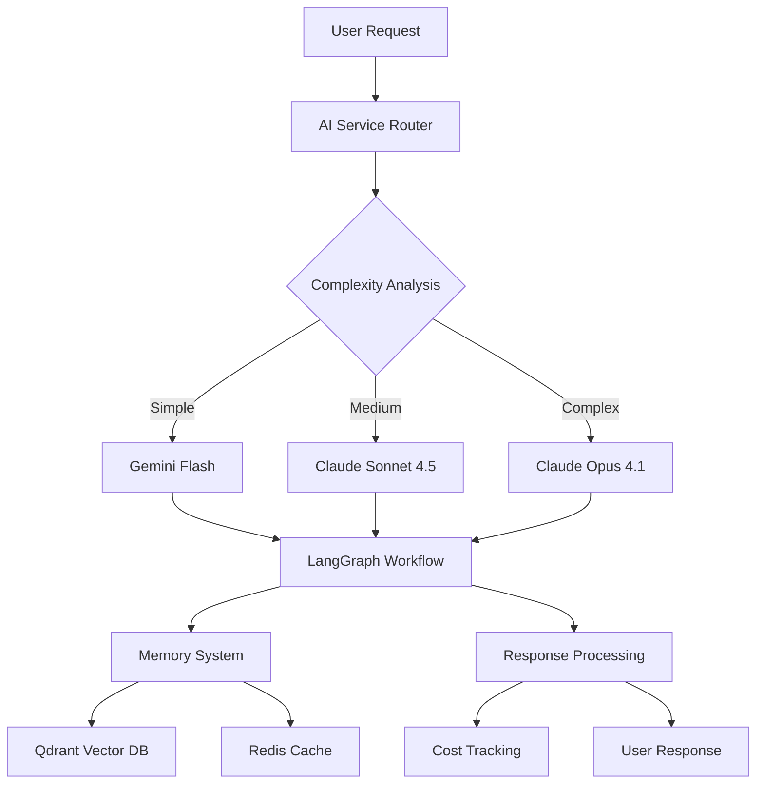

# AI Integration Guide

## Overview

Ardha's AI integration provides intelligent assistance throughout the project management lifecycle. From market research and requirements generation to task breakdown and code implementation, AI workflows enhance productivity while maintaining human control. This guide covers the complete AI architecture, workflow system, and integration patterns.

## Architecture

### AI System Components



### Multi-Model Strategy

Ardha uses intelligent model routing based on task complexity:

- **Simple Tasks (35%)**: Gemini Flash for basic queries, summaries, and quick responses
- **Medium Tasks (45%)**: Claude Sonnet 4.5 for general development tasks and analysis
- **Complex Tasks (20%)**: Claude Opus 4.1 for architecture decisions and complex problem-solving

### Cost Management

**Budget Controls:**
- Daily limit: $2.00
- Monthly limit: $60.00
- Real-time cost tracking
- Automatic throttling at limits
- Transparent cost reporting

**Optimization Strategies:**
- Prompt caching (78-90% cost reduction)
- Hierarchical context loading
- Model-specific pricing awareness
- Token usage optimization

## LangGraph Workflows

### Workflow Architecture

```python
# backend/src/ardha/workflows/base.py
class BaseWorkflow:
    """Base class for all AI workflows."""

    def __init__(self):
        self.graph = StateGraph(WorkflowState)
        self.checkpointer = RedisCheckpointer()
        self.memory = QdrantMemory()
        self.cost_tracker = CostTracker()

    def add_node(self, name: str, node: BaseNode):
        """Add a node to the workflow."""
        self.graph.add_node(name, node)

    def add_edge(self, from_node: str, to_node: str):
        """Add an edge between nodes."""
        self.graph.add_edge(from_node, to_node)

    async def execute(self, inputs: dict) -> AsyncIterator[dict]:
        """Execute workflow with streaming."""
        async for output in self.graph.astream(
            inputs,
            checkpoint=self.checkpointer,
            interrupt_before=["human_approval"]
        ):
            yield output
```

### Workflow Types

#### 1. Research Workflow

**Purpose**: Market research, competitive analysis, feasibility studies

**Nodes**:
- **ResearchNode**: Gather information from various sources
- **AnalyzeNode**: Analyze and synthesize research findings
- **ReportNode**: Generate comprehensive research report

```python
# backend/src/ardha/workflows/research_workflow.py
class ResearchWorkflow(BaseWorkflow):
    def __init__(self):
        super().__init__()

        # Add nodes
        self.add_node("research", ResearchNode())
        self.add_node("analyze", AnalyzeNode())
        self.add_node("report", ReportNode())

        # Define flow
        self.add_edge("research", "analyze")
        self.add_edge("analyze", "report")

        # Set entry point
        self.set_entry_point("research")

        # Compile with checkpointing
        self.compile()
```

#### 2. PRD Workflow

**Purpose**: Product Requirements Document generation

**Nodes**:
- **RequirementsNode**: Extract and organize requirements
- **ArchitectureNode**: Design system architecture
- **SpecificationNode**: Create detailed specifications

```python
# backend/src/ardha/workflows/prd_workflow.py
class PRDWorkflow(BaseWorkflow):
    def __init__(self):
        super().__init__()

        self.add_node("requirements", RequirementsNode())
        self.add_node("architecture", ArchitectureNode())
        self.add_node("specification", SpecificationNode())

        self.add_edge("requirements", "architecture")
        self.add_edge("architecture", "specification")

        self.set_entry_point("requirements")
        self.compile()
```

#### 3. Task Generation Workflow

**Purpose**: Automated task breakdown and estimation

**Nodes**:
- **BreakdownNode**: Break down project into tasks
- **EstimateNode**: Estimate effort and complexity
- **DependencyNode**: Identify task dependencies

```python
# backend/src/ardha/workflows/task_generation_workflow.py
class TaskGenerationWorkflow(BaseWorkflow):
    def __init__(self):
        super().__init__()

        self.add_node("breakdown", BreakdownNode())
        self.add_node("estimate", EstimateNode())
        self.add_node("dependency", DependencyNode())

        self.add_edge("breakdown", "estimate")
        self.add_edge("estimate", "dependency")

        self.set_entry_point("breakdown")
        self.compile()
```

### Node Implementation

#### Base Node Class

```python
# backend/src/ardha/workflows/nodes/base.py
class BaseNode:
    """Base class for workflow nodes."""

    def __init__(self):
        self.ai_service = AIService()
        self.memory_service = MemoryService()
        self.cost_tracker = CostTracker()

    async def execute(self, state: WorkflowState) -> WorkflowState:
        """Execute node logic."""
        raise NotImplementedError

    async def load_context(self, state: WorkflowState) -> dict:
        """Load relevant context for the node."""
        context = {}

        # Load project context
        if state.project_id:
            context["project"] = await self.memory_service.get_project_context(
                state.project_id
            )

        # Load task context
        if state.task_id:
            context["task"] = await self.memory_service.get_task_context(
                state.task_id
            )

        # Load recent history
        context["recent_history"] = await self.memory_service.get_recent_history(
            state.session_id, limit=10
        )

        return context
```

#### Research Node Example

```python
# backend/src/ardha/workflows/nodes/research_nodes.py
class ResearchNode(BaseNode):
    async def execute(self, state: WorkflowState) -> WorkflowState:
        """Execute research phase."""

        # Load context
        context = await self.load_context(state)

        # Prepare research prompt
        prompt = self.build_research_prompt(state.query, context)

        # Select model based on complexity
        model = self.ai_service.select_model("medium")

        # Execute research
        response = await self.ai_service.complete(
            model=model,
            messages=prompt,
            temperature=0.7,
            max_tokens=2000
        )

        # Track cost
        await self.cost_tracker.track_usage(
            model=model,
            input_tokens=response.usage.input_tokens,
            output_tokens=response.usage.output_tokens
        )

        # Update state
        state.research_data = response.content
        state.current_node = "analyze"

        # Store in memory
        await self.memory_service.store_memory(
            content=response.content,
            metadata={
                "type": "research",
                "project_id": state.project_id,
                "session_id": state.session_id
            }
        )

        return state

    def build_research_prompt(self, query: str, context: dict) -> list:
        """Build research prompt with context."""
        system_prompt = """
        You are a research assistant helping with project planning and analysis.
        Conduct thorough research on the given topic and provide comprehensive insights.
        Focus on:
        1. Market analysis and trends
        2. Competitive landscape
        3. Technical feasibility
        4. Potential challenges and solutions
        5. Recommendations and next steps
        """

        user_prompt = f"""
        Research Topic: {query}

        Project Context:
        {context.get('project', 'No project context available')}

        Please provide a comprehensive research report covering all aspects mentioned above.
        """

        return [
            {"role": "system", "content": system_prompt},
            {"role": "user", "content": user_prompt}
        ]
```

## Memory System

### Vector Database Integration

```python
# backend/src/ardha/services/memory_service.py
class MemoryService:
    """Manages AI memory using Qdrant vector database."""

    def __init__(self):
        self.client = QdrantClient()
        self.embedding_model = SentenceTransformer('all-MiniLM-L6-v2')

    async def store_memory(self, content: str, metadata: dict):
        """Store content in vector memory."""
        # Generate embedding
        embedding = self.embedding_model.encode(content)

        # Store in Qdrant
        await self.client.upsert(
            collection_name="memories",
            points=[PointStruct(
                id=uuid4(),
                vector=embedding.tolist(),
                payload={
                    "content": content,
                    "metadata": metadata,
                    "created_at": datetime.utcnow().isoformat()
                }
            )]
        )

    async def search_memories(
        self,
        query: str,
        project_id: str = None,
        limit: int = 5
    ) -> list:
        """Search memories by semantic similarity."""
        # Generate query embedding
        query_embedding = self.embedding_model.encode(query)

        # Build filter
        filter_condition = None
        if project_id:
            filter_condition = Filter(
                must=[FieldCondition(
                    key="metadata.project_id",
                    match=MatchValue(value=project_id)
                )]
            )

        # Search
        results = await self.client.search(
            collection_name="memories",
            query_vector=query_embedding.tolist(),
