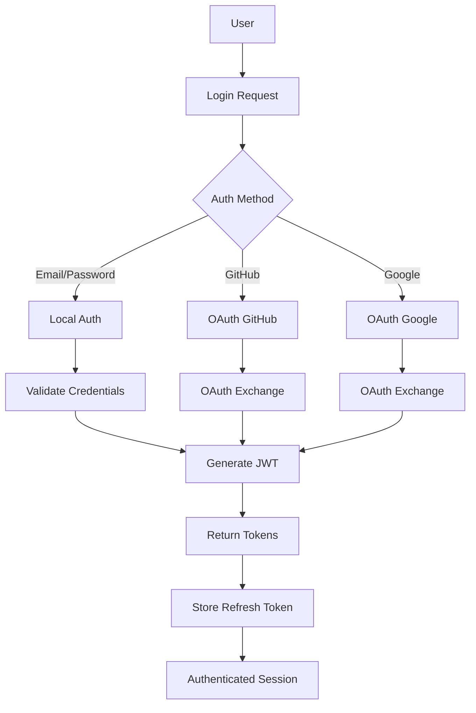

# Authentication System Guide

## Overview

Ardha's authentication system provides secure, flexible user management with support for multiple authentication methods, role-based access control, and seamless integration with external identity providers. This guide covers the complete authentication architecture, implementation details, and best practices.

## Architecture

### Authentication Flow



### Token-Based Authentication

Ardha uses JWT (JSON Web Tokens) for stateless authentication:

- **Access Token**: Short-lived (15 minutes) for API requests
- **Refresh Token**: Long-lived (7 days) for token renewal
- **Secure Storage**: Refresh tokens stored in database with rotation

### Role-Based Access Control (RBAC)

Four-tier permission system:

1. **Viewer**: Read-only access to projects
2. **Member**: Full project participation
3. **Admin**: Project management capabilities
4. **Owner**: Complete control over projects

## Implementation Details

### Core Components

#### 1. User Model

```python
# backend/src/ardha/models/user.py
class User(Base):
    __tablename__ = "users"

    id = Column(UUID(as_uuid=True), primary_key=True, default=uuid4)
    email = Column(String, unique=True, index=True, nullable=False)
    username = Column(String, unique=True, index=True, nullable=False)
    full_name = Column(String)
    hashed_password = Column(String)  # Null for OAuth users
    is_active = Column(Boolean, default=True)
    is_verified = Column(Boolean, default=False)

    # OAuth fields
    github_id = Column(String, unique=True)
    google_id = Column(String, unique=True)

    # Timestamps
    created_at = Column(DateTime, default=datetime.utcnow)
    updated_at = Column(DateTime, default=datetime.utcnow, onupdate=datetime.utcnow)
    last_login = Column(DateTime)
```

#### 2. Authentication Service

```python
# backend/src/ardha/services/auth_service.py
class AuthService:
    def __init__(self, db: AsyncSession):
        self.db = db
        self.security = SecurityService()

    async def authenticate_user(
        self,
        email: str,
        password: str
    ) -> Optional[User]:
        """Authenticate user with email and password."""
        user = await self.user_repo.get_by_email(email)
        if not user or not user.is_active:
            return None

        if not self.security.verify_password(password, user.hashed_password):
            return None

        # Update last login
        user.last_login = datetime.utcnow()
        await self.db.commit()

        return user

    async def create_tokens(
        self,
        user_id: str
    ) -> TokenResponse:
        """Create access and refresh tokens."""
        access_token = self.security.create_access_token(user_id)
        refresh_token = self.security.create_refresh_token(user_id)

        # Store refresh token
        await self.token_repo.create_refresh_token(
            user_id=user_id,
            token=refresh_token,
            expires_at=datetime.utcnow() + timedelta(days=7)
        )

        return TokenResponse(
            access_token=access_token,
            refresh_token=refresh_token,
            token_type="bearer",
            expires_in=900  # 15 minutes
        )
```

#### 3. Security Service

```python
# backend/src/ardha/core/security.py
class SecurityService:
    def __init__(self):
        self.secret_key = settings.secret_key
        self.algorithm = "HS256"
        self.pwd_context = CryptContext(schemes=["bcrypt"], deprecated="auto")

    def verify_password(self, plain_password: str, hashed_password: str) -> bool:
        """Verify password against hash."""
        return self.pwd_context.verify(plain_password, hashed_password)

    def hash_password(self, password: str) -> str:
        """Hash password using bcrypt."""
        return self.pwd_context.hash(password)

    def create_access_token(self, user_id: str) -> str:
        """Create JWT access token."""
        payload = {
            "sub": user_id,
            "exp": datetime.utcnow() + timedelta(minutes=15),
            "type": "access",
            "iat": datetime.utcnow()
        }
        return jwt.encode(payload, self.secret_key, algorithm=self.algorithm)

    def create_refresh_token(self, user_id: str) -> str:
        """Create JWT refresh token."""
        payload = {
            "sub": user_id,
            "exp": datetime.utcnow() + timedelta(days=7),
            "type": "refresh",
            "iat": datetime.utcnow()
        }
        return jwt.encode(payload, self.secret_key, algorithm=self.algorithm)
```

### OAuth Integration

#### GitHub OAuth

```python
# backend/src/ardha/services/oauth_service.py
class GitHubOAuthService:
    def __init__(self):
        self.client_id = settings.github_client_id
        self.client_secret = settings.github_client_secret
        self.redirect_uri = settings.github_redirect_uri

    async def get_authorization_url(self, state: str) -> str:
        """Generate GitHub OAuth authorization URL."""
        params = {
            "client_id": self.client_id,
            "redirect_uri": self.redirect_uri,
            "scope": "user:email",
            "state": state
        }
        return f"https://github.com/login/oauth/authorize?{urlencode(params)}"

    async def exchange_code_for_token(self, code: str) -> dict:
        """Exchange authorization code for access token."""
        data = {
            "client_id": self.client_id,
            "client_secret": self.client_secret,
            "code": code,
            "redirect_uri": self.redirect_uri
        }

        async with httpx.AsyncClient() as client:
            response = await client.post(
                "https://github.com/login/oauth/access_token",
                data=data,
                headers={"Accept": "application/json"}
            )
            return response.json()

    async def get_user_info(self, access_token: str) -> dict:
        """Get user information from GitHub API."""
        headers = {"Authorization": f"token {access_token}"}

        async with httpx.AsyncClient() as client:
            response = await client.get(
                "https://api.github.com/user",
                headers=headers
            )
            return response.json()

    async def authenticate_or_create_user(self, github_data: dict) -> User:
        """Authenticate existing user or create new one from GitHub data."""
        github_id = str(github_data["id"])
        email = github_data["email"]

        # Check for existing user by GitHub ID
        user = await self.user_repo.get_by_github_id(github_id)
        if user:
            return user

        # Check for existing user by email
        user = await self.user_repo.get_by_email(email)
        if user:
            # Link GitHub account
            user.github_id = github_id
            await self.db.commit()
            return user

        # Create new user
        user = User(
            email=email,
            username=github_data["login"],
            full_name=github_data.get("name"),
            github_id=github_id,
            is_verified=True,
            is_active=True
        )

        await self.user_repo.create(user)
        return user
```

## API Endpoints

### Authentication Endpoints

#### Register User

```http
POST /api/v1/auth/register
Content-Type: application/json

{
  "email": "user@example.com",
  "username": "username",
  "full_name": "Full Name",
  "password": "SecurePassword123"
}
```

**Response:**
```json
{
  "message": "User created successfully",
  "user": {
    "id": "uuid",
    "email": "user@example.com",
    "username": "username",
    "full_name": "Full Name",
    "is_active": true,
    "is_verified": false,
    "created_at": "2024-01-01T00:00:00Z"
  }
}
```

#### Login

```http
POST /api/v1/auth/login
Content-Type: application/x-www-form-urlencoded

username=user@example.com&password=SecurePassword123
```

**Response:**
```json
{
  "access_token": "eyJ0eXAiOiJKV1QiLCJhbGciOiJIUzI1NiJ9...",
  "refresh_token": "eyJ0eXAiOiJKV1QiLCJhbGciOiJIUzI1NiJ9...",
  "token_type": "bearer",
  "expires_in": 900,
  "user": {
    "id": "uuid",
    "email": "user@example.com",
    "username": "username"
  }
}
```

#### Refresh Token

```http
POST /api/v1/auth/refresh
Content-Type: application/json

{
  "refresh_token": "eyJ0eXAiOiJKV1QiLCJhbGciOiJIUzI1NiJ9..."
}
```

#### Logout

```http
POST /api/v1/auth/logout
Authorization: Bearer <access_token>
```

### OAuth Endpoints

#### GitHub OAuth Flow

1. **Get Authorization URL**
```http
GET /api/v1/oauth/github/authorize?state=random_string
```

2. **Callback Handler**
```http
GET /api/v1/oauth/github/callback?code=auth_code&state=random_string
```

3. **Exchange Code for Tokens**
```http
POST /api/v1/oauth/github/exchange
Content-Type: application/json

{
  "code": "authorization_code"
}
```

## Usage Examples

### Frontend Integration

#### React Hook for Authentication

```typescript
// frontend/src/lib/hooks/use-auth.ts
import { useAuthStore } from '@/lib/stores/auth-store'

export function useAuth() {
  const { user, tokens, isAuthenticated, login, logout, refresh } = useAuthStore()

  const loginUser = async (email: string, password: string) => {
    try {
      const response = await fetch('/api/v1/auth/login', {
        method: 'POST',
        headers: { 'Content-Type': 'application/x-www-form-urlencoded' },
        body: new URLSearchParams({ username: email, password })
      })

      if (!response.ok) throw new Error('Login failed')

      const data = await response.json()
      login(data.user, data.tokens)

      return data
    } catch (error) {
      console.error('Login error:', error)
      throw error
    }
  }

  const logoutUser = async () => {
    try {
      await fetch('/api/v1/auth/logout', {
        method: 'POST',
        headers: { 'Authorization': `Bearer ${tokens.access_token}` }
      })
    } catch (error) {
      console.error('Logout error:', error)
    } finally {
      logout()
    }
  }

  return {
    user,
    isAuthenticated,
    login: loginUser,
    logout: logoutUser,
    refresh
  }
}
```

#### Authentication Middleware

```typescript
// frontend/src/lib/middleware/auth.ts
export function withAuth<T extends Record<string, any>>(
  Component: React.ComponentType<T>
) {
  return function AuthenticatedComponent(props: T) {
    const { isAuthenticated } = useAuth()
    const router = useRouter()

    useEffect(() => {
      if (!isAuthenticated) {
        router.push('/auth/login')
      }
    }, [isAuthenticated, router])

    if (!isAuthenticated) {
      return <div>Loading...</div>
    }

    return <Component {...props} />
  }
}
```

### Backend Integration

#### Protected Route Decorator

```python
# backend/src/ardha/api/deps.py
from fastapi import Depends, HTTPException, status
from fastapi.security import HTTPBearer, HTTPAuthorizationCredentials
from jose import JWTError, jwt

security = HTTPBearer()

async def get_current_user(
    credentials: HTTPAuthorizationCredentials = Depends(security),
    db: AsyncSession = Depends(get_db)
) -> User:
    """Get current authenticated user."""
    credentials_exception = HTTPException(
        status_code=status.HTTP_401_UNAUTHORIZED,
        detail="Could not validate credentials",
        headers={"WWW-Authenticate": "Bearer"},
    )

    try:
        payload = jwt.decode(
            credentials.credentials,
            settings.secret_key,
            algorithms=[settings.jwt_algorithm]
        )
        user_id: str = payload.get("sub")
        token_type: str = payload.get("type")

        if user_id is None or token_type != "access":
            raise credentials_exception
    except JWTError:
        raise credentials_exception

    user = await user_repo.get_by_id(db, user_id)
    if user is None:
        raise credentials_exception

    return user

async def get_current_active_user(
    current_user: User = Depends(get_current_user)
) -> User:
    """Get current active user."""
    if not current_user.is_active:
        raise HTTPException(status_code=400, detail="Inactive user")
    return current_user
```

#### Permission Checking

```python
# backend/src/ardha/services/permission_service.py
class PermissionService:
    async def check_project_permission(
        self,
        user: User,
        project_id: str,
        required_role: str
    ) -> bool:
        """Check if user has required role in project."""
        membership = await self.project_membership_repo.get_by_user_and_project(
            user.id, project_id
        )

        if not membership:
            return False

        role_hierarchy = {
            "viewer": 1,
            "member": 2,
            "admin": 3,
            "owner": 4
        }

        user_level = role_hierarchy.get(membership.role, 0)
        required_level = role_hierarchy.get(required_role, 0)

        return user_level >= required_level
```

## Configuration

### Environment Variables

```bash
# JWT Configuration
SECRET_KEY=your-very-secure-secret-key-here
JWT_ALGORITHM=HS256
ACCESS_TOKEN_EXPIRE_MINUTES=15
REFRESH_TOKEN_EXPIRE_DAYS=7

# GitHub OAuth
GITHUB_CLIENT_ID=your-github-client-id
GITHUB_CLIENT_SECRET=your-github-client-secret
GITHUB_REDIRECT_URI=http://localhost:8000/api/v1/oauth/github/callback

# Google OAuth
GOOGLE_CLIENT_ID=your-google-client-id
GOOGLE_CLIENT_SECRET=your-google-client-secret
GOOGLE_REDIRECT_URI=http://localhost:8000/api/v1/oauth/google/callback

# Email Verification
SMTP_HOST=smtp.gmail.com
SMTP_PORT=587
SMTP_USER=your-email@gmail.com
SMTP_PASSWORD=your-app-password
EMAIL_FROM=noreply@ardha.com
```

### Security Settings

```python
# backend/src/ardha/core/config.py
class SecuritySettings(BaseSettings):
    secret_key: str = Field(..., min_length=32)
    jwt_algorithm: str = "HS256"
    access_token_expire_minutes: int = 15
    refresh_token_expire_days: int = 7

    # Password requirements
    password_min_length: int = 8
    password_require_uppercase: bool = True
    password_require_lowercase: bool = True
    password_require_numbers: bool = True
    password_require_symbols: bool = True

    # Rate limiting
    login_attempts_limit: int = 5
    login_attempts_window: int = 300  # 5 minutes

    class Config:
        env_prefix = "SECURITY_"
```

## Best Practices

### Security Best Practices

1. **Strong Secret Keys**
   - Use cryptographically secure random strings
   - Rotate secrets regularly in production
   - Store secrets in environment variables or secret managers

2. **Password Security**
   - Enforce strong password requirements
   - Use bcrypt with proper work factor
   - Implement password reset functionality

3. **Token Management**
   - Use short-lived access tokens
   - Implement refresh token rotation
   - Store refresh tokens securely in database

4. **OAuth Security**
   - Validate state parameter to prevent CSRF
   - Use HTTPS for all OAuth flows
   - Implement PKCE for additional security

### Implementation Best Practices

1. **Error Handling**
   - Don't reveal sensitive information in error messages
   - Use generic error messages for authentication failures
   - Log authentication attempts for security monitoring

2. **Session Management**
   - Implement proper logout functionality
   - Handle token expiration gracefully
   - Provide refresh token rotation

3. **User Experience**
   - Provide clear error messages
   - Implement social login options
   - Support password recovery

## Troubleshooting

### Common Issues

#### 1. Token Validation Fails

**Problem**: JWT tokens are not being validated correctly.

**Solutions**:
- Check that the secret key is the same across all services
- Verify the token hasn't expired
- Ensure the token type is correct (access vs refresh)
- Check the algorithm matches between creation and validation

#### 2. OAuth Callback Fails

**Problem**: OAuth callback returns an error.

**Solutions**:
- Verify redirect URI matches OAuth app configuration
- Check that client ID and secret are correct
- Ensure the state parameter is properly validated
- Check network connectivity to OAuth provider

#### 3. User Creation Fails

**Problem**: User registration fails with validation errors.

**Solutions**:
- Check email format and uniqueness
- Verify password meets requirements
- Ensure username is unique and valid
- Check database connection and constraints

#### 4. Permission Check Fails

**Problem**: User permissions are not being recognized.

**Solutions**:
- Verify user is active and verified
- Check project membership exists
- Ensure role hierarchy is properly configured
- Verify permission checking logic

### Debugging Tools

#### 1. JWT Token Inspector

```python
# Debug JWT token
def inspect_token(token: str):
    try:
        payload = jwt.decode(
            token,
            settings.secret_key,
            algorithms=[settings.jwt_algorithm]
        )
        print("Token payload:", payload)
        print("Token expires:", datetime.fromtimestamp(payload["exp"]))
    except JWTError as e:
        print("Token error:", e)
```

#### 2. Authentication Flow Logger

```python
# Log authentication attempts
import logging

logger = logging.getLogger(__name__)

async def log_auth_attempt(email: str, success: bool, ip_address: str):
    if success:
        logger.info(f"Successful login: {email} from {ip_address}")
    else:
        logger.warning(f"Failed login attempt: {email} from {ip_address}")
```

## Testing

### Unit Tests

```python
# tests/unit/test_auth_service.py
@pytest.mark.asyncio
async def test_authenticate_user_success():
    """Test successful user authentication."""
    # Create test user
    user = User(
        email="test@example.com",
        username="testuser",
        hashed_password="$2b$12$..."  # bcrypt hash
    )

    # Test authentication
    result = await auth_service.authenticate_user(
        "test@example.com",
        "password123"
    )

    assert result is not None
    assert result.email == "test@example.com"

@pytest.mark.asyncio
async def test_authenticate_user_invalid_password():
    """Test authentication with invalid password."""
    result = await auth_service.authenticate_user(
        "test@example.com",
        "wrongpassword"
    )

    assert result is None
```

### Integration Tests

```python
# tests/integration/test_auth_api.py
async def test_login_flow(client):
    """Test complete login flow."""
    # Register user
    response = await client.post("/api/v1/auth/register", json={
        "email": "test@example.com",
        "username": "testuser",
        "password": "SecurePassword123"
    })
    assert response.status_code == 201

    # Login
    response = await client.post(
        "/api/v1/auth/login",
        data="username=test@example.com&password=SecurePassword123"
    )
    assert response.status_code == 200

    data = response.json()
    assert "access_token" in data
    assert "refresh_token" in data

    # Use token to access protected endpoint
    response = await client.get(
        "/api/v1/auth/me",
        headers={"Authorization": f"Bearer {data['access_token']}"}
    )
    assert response.status_code == 200
```

## API Reference

### Authentication Schemas

#### UserCreate
```python
class UserCreate(BaseModel):
    email: EmailStr
    username: str = Field(..., min_length=3, max_length=50)
    full_name: Optional[str] = None
    password: str = Field(..., min_length=8)
```

#### UserResponse
```python
class UserResponse(BaseModel):
    id: UUID
    email: str
    username: str
    full_name: Optional[str]
    is_active: bool
    is_verified: bool
    created_at: datetime
    last_login: Optional[datetime]
```

#### TokenResponse
```python
class TokenResponse(BaseModel):
    access_token: str
    refresh_token: str
    token_type: str = "bearer"
    expires_in: int
```

### Error Responses

#### Authentication Errors
```json
{
  "detail": "Incorrect email or password",
  "error_code": "INVALID_CREDENTIALS"
}
```

#### Authorization Errors
```json
{
  "detail": "Insufficient permissions",
  "error_code": "INSUFFICIENT_PERMISSIONS"
}
```

#### Validation Errors
```json
{
  "detail": [
    {
      "loc": ["body", "email"],
      "msg": "field is not a valid email address",
      "type": "value_error.email"
    }
  ]
}
```

---

**Version**: 1.0
**Last Updated**: November 24, 2024
**Maintained By**: Ardha Development Team
